# Questao 1

**A luz tem comportamento de onda e partícula.** Em 1905, Einstein falou sobre fótons, que são partículas sem massa com energia $hf$, onde $h$ é a constante de Planck (6,626×10−34 J.s). Os fótons foram aceitos após os experimentos de Compton em 1922, que estudaram raios X em materiais leves como o grafite.

**Dicas de apoio**
- A luz pode apresentar comportamento ondulatório e corpuscular, dependendo do fenômeno observado.
- A constante de Planck ($h$) é uma constante fundamental na física quântica, utilizada para calcular a energia de um fóton através da fórmula $E = hf$, onde $E$ é a energia e $f$ é a frequência da radiação.
- Os experimentos de Compton demonstraram o efeito de espalhamento de raios X, evidenciando o comportamento corpuscular da radiação.

**Passo a Passo**
1. Revise os conceitos de natureza ondulatória e corpuscular da luz.
2. Considere o papel dos experimentos de Compton na aceitação da teoria dos fótons.
3. Reflita sobre como a energia de um fóton está relacionada à sua frequência, usando a fórmula $E = hf$.
4. Analise cada opção de resposta à luz dos conceitos revisados e escolha a mais coerente.

De acordo com o texto, é correto afirmar:

Opções de resposta:

A) A radiação eletromagnética apresenta somente comportamento ondulatório.

B) Os experimentos de Compton mostraram que feixes de raios X exibem comportamento de partículas.

C) A energia de um fóton independe de seu comprimento de onda.

D) A hipótese da natureza de partículas da radiação está em desacordo com os resultados experimentais.

E) Einstein demonstrou que os experimentos de difração e interferência da luz deveriam estar incorretos.

# Questao 2

Para esfriar 250 mL de água fervente (100°C), siga estes passos:

1. Coloque o copo em uma vasilha com 1 litro de água a 25°C. Veja a figura.
2. Espere até que a temperatura se iguale.
3. Troque a água da vasilha por outro litro a 25°C.
4. Coloque o copo novamente na vasilha e espere a temperatura se igualar.

**Dicas de apoio**
- O conceito de equilíbrio térmico é importante aqui: quando dois corpos estão em contato térmico, eles trocam calor até atingirem a mesma temperatura.
- Utilize a fórmula de calor sensível $Q = mcΔT$, onde $Q$ é o calor trocado, $m$ é a massa, $c$ é o calor específico e $ΔT$ é a variação de temperatura, para calcular a temperatura final.
- Despreze as trocas de calor com o ambiente, conforme indicado.

**Passo a Passo**
1. Revise o conceito de equilíbrio térmico e como ele é alcançado.
2. Considere a capacidade térmica da água e como ela afeta a troca de calor.
3. Pense sobre o efeito de repetir o processo de troca de calor duas vezes.
4. Use as informações para estimar a temperatura final da água no copo.

Após o passo 4, a temperatura da água no copo será aproximadamente:

Opções de resposta:

A) 14°C

B) 28°C

C) 40°C

D) 60°C

E) 84°C

# Questao 3

Raios cósmicos são perigosos para humanos. A dose de radiação é medida em sieverts (Sv). A exposição aumenta com a altitude, afetando tripulações de aviões. Em voos entre Rio de Janeiro e Roma, a dose média é 2 μSv/h. Tripulações podem trabalhar até 1 000 horas por ano. Uma radiografia torácica tem dose de 0,2 mSv.

**Dicas de apoio**
- Converta as unidades de μSv para mSv para facilitar a comparação.
- Calcule a dose total anual multiplicando a dose por hora pelo número de horas trabalhadas.
- Compare a dose total anual com a dose de uma radiografia torácica para encontrar o número equivalente de radiografias.

**Passo a Passo**
1. Calcule a dose total de radiação recebida em um ano, multiplicando a dose por hora pelo número total de horas.
2. Converta a dose total de μSv para mSv para facilitar a comparação.
3. Divida a dose total anual pela dose de uma radiografia torácica para encontrar o número equivalente de radiografias.

Quantas radiografias torácicas equivalem à dose de radiação recebida por um tripulante em um ano?

Opções de resposta:

A) 8

B) 10

C) 80

D) 100

E) 1 000

# Questao 4

A temperatura alta fora da cápsula ioniza o ar, criando uma barreira para ondas de rádio. O gráfico mostra que quanto maior a temperatura do ar, maior a frequência limite para comunicação. Se a temperatura do ar for 4800 K, qual é o comprimento de onda correspondente?

Dado: Velocidade da luz no vácuo: c = 3,0 ×108 m/s

**Dicas de apoio**
- Utilize a relação entre velocidade da luz, frequência e comprimento de onda: $c = λf$, onde $c$ é a velocidade da luz, $λ$ é o comprimento de onda e $f$ é a frequência.
- Para encontrar o comprimento de onda, rearranje a fórmula para $λ = \frac{c}{f}$.
- Consulte o gráfico para determinar a frequência limite correspondente à temperatura dada.

**Passo a Passo**
1. Revise o conceito de frequência e comprimento de onda, e como eles estão relacionados pela fórmula $c = λf$.
2. Use o gráfico para determinar a frequência limite $f_0$ correspondente à temperatura de 4800 K.
3. Substitua os valores conhecidos na fórmula para encontrar o comprimento de onda $λ_0$.

Opções de resposta:

A) 0,06 m.

B) 16,7 m.

C) 0,05 m.

D) 20 m.

# Questao 5

Os municípios gerenciam a coleta de lixo, mas parte é incinerada, liberando toxinas. Frascos de aerossóis podem explodir quando aquecidos. Um frasco de 100 mL com 0,1 mol de gás a 650 °C explode.

Considere: R = 0,082 L atm/mol K

**Dicas de apoio**
- Utilize a equação dos gases ideais $PV = nRT$, onde $P$ é a pressão, $V$ é o volume, $n$ é o número de mols, $R$ é a constante dos gases e $T$ é a temperatura em Kelvin.
- Converta a temperatura de Celsius para Kelvin somando 273.
- Rearranje a equação para encontrar a pressão: $P = \frac{nRT}{V}$.

**Passo a Passo**
1. Revise a equação dos gases ideais: $PV = nRT$.
2. Converta a temperatura de Celsius para Kelvin.
3. Substitua os valores conhecidos na equação para calcular a pressão.

A pressão dentro do frasco, no momento da explosão, é mais próxima de

Opções de resposta:

A) 756.

B) 533.

C) 76.

D) 53.

E) 13.

# Questao 6

O manual do carro recomenda verificar a pressão dos pneus frios. Um motorista verificou a pressão após uma viagem longa com pneus quentes. A pressão não era a recomendada. Após esfriar, a pressão e a temperatura dos pneus mudaram. Considere o ar como gás ideal. O gráfico mostra a relação entre pressão e temperatura.

**Dicas de apoio**
- A relação entre pressão e temperatura para um gás ideal é dada pela lei de Gay-Lussac: $\frac{P}{T} = \text{constante}$.
- Quando a temperatura diminui, a pressão também diminui, se o volume for constante.
- Analise o gráfico fornecido para identificar como a pressão varia com a temperatura.

**Passo a Passo**
1. Revise a lei dos gases ideais e como a pressão e a temperatura estão relacionadas quando o volume é constante.
2. Considere como a pressão varia com a temperatura durante o resfriamento.
3. Analise cada gráfico e escolha aquele que melhor representa a relação entre pressão e temperatura.

Opções de resposta:

A) 
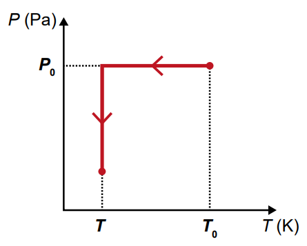

B) 
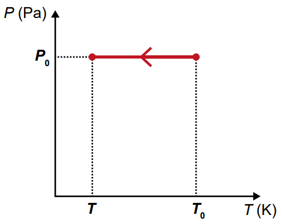

C) 
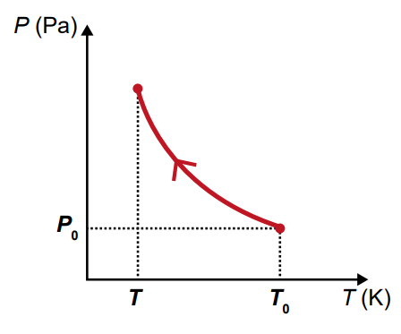

D) 
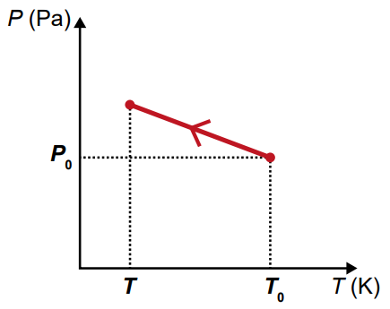

E) 
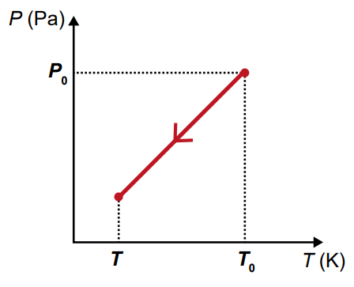

# Questao 7

Uma máquina térmica caseira usa uma bomba de bicicleta, uma câmara de pneu e um aquecedor. O gás é comprimido, aquecido, expandido e resfriado. Qual diagrama representa melhor esse ciclo no gráfico pressão x volume?

**Dicas de apoio**
- A compressão adiabática ocorre sem troca de calor com o ambiente, resultando em aumento de pressão e temperatura.
- O aquecimento isovolumétrico ocorre a volume constante, aumentando a pressão.
- A expansão adiabática ocorre sem troca de calor, diminuindo a pressão e a temperatura.
- O resfriamento isovolumétrico ocorre a volume constante, diminuindo a pressão.
- Analise o gráfico para identificar as mudanças de pressão e volume em cada etapa.

**Passo a Passo**
1. Revise os conceitos de compressão adiabática, aquecimento isovolumétrico, expansão adiabática e resfriamento isovolumétrico.
2. Considere como cada etapa do ciclo afeta a pressão e o volume do gás.
3. Analise cada diagrama e escolha aquele que melhor representa o ciclo descrito.

Opções de resposta:

A) 
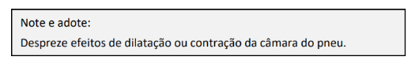

B) 
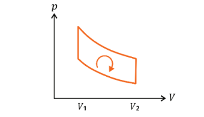

C) 
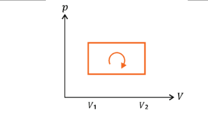

D) 
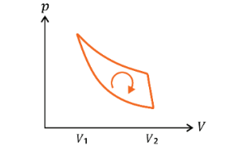

E) 
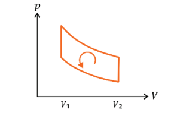

F) 
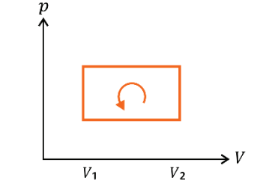

# Questao 8

Uma cafeteria usa copos de 50% plástico reciclado e 50% casca de café. O copo é reutilizável e não esquenta por fora. Quais são as duas vantagens desse copo em relação ao descartável?

**Dicas de apoio**
- Considere as propriedades térmicas do material, como baixa condutividade térmica, que impede que o calor passe facilmente para a parte externa.
- Avalie o impacto ambiental, como a redução de resíduos não biodegradáveis devido ao uso de materiais reciclados.

**Passo a Passo**
1. Revise as características dos materiais utilizados na fabricação dos copos.
2. Considere como a reutilização e a composição do copo afetam o meio ambiente.
3. Compare as vantagens de durabilidade e condutividade térmica entre os copos.

Opções de resposta:

A) Ter a durabilidade de uma cerâmica e ser totalmente biodegradável.

B) Ser tão durável quanto uma cerâmica e ter alta condutividade térmica.

C) Ser um mau condutor térmico e aumentar o resíduo biodegradável na natureza.

D) Ter baixa condutividade térmica e reduzir o resíduo não biodegradável na natureza.

E) Ter alta condutividade térmica e possibilitar a degradação do material no meio ambiente.

# Questao 9

O petróleo é valioso e métodos geofísicos ajudam a encontrá-lo. Um pulso acústico é usado para medir a velocidade do som em camadas de líquido e rocha. O tempo entre o pulso e o eco é medido. A velocidade do som na camada líquida é

**Dicas de apoio**
- Utilize a fórmula da velocidade média: $v = \frac{d}{t}$, onde $v$ é a velocidade, $d$ é a distância percorrida e $t$ é o tempo.
- Lembre-se de que o som percorre a distância duas vezes (ida e volta) para cada eco.
- Calcule a velocidade para cada eco separadamente e compare os resultados.

**Passo a Passo**
1. Revise o conceito de velocidade do som e como ela é calculada.
2. Use o tempo de viagem do pulso e a profundidade da camada para calcular a velocidade.
3. Considere a diferença entre os tempos dos ecos para determinar a velocidade correta.

Opções de resposta:

A) 270.

B) 540.

C) 818.

D) 1 500.

E) 1 800

# Questao 10

Um experimento usa uma canaleta com areia e um alto-falante para criar ondas estacionárias. A régua na imagem ajuda a medir o comprimento de onda.

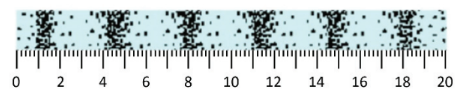

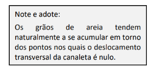

**Dicas de apoio**
- Ondas estacionárias são formadas por padrões de interferência onde certas áreas, chamadas nós, permanecem estacionárias.
- Utilize a régua na figura para medir a distância entre dois nós consecutivos, que corresponde a meio comprimento de onda.
- Multiplique a distância medida por dois para encontrar o comprimento de onda completo.

**Passo a Passo**
1. Revise o conceito de ondas estacionárias e como o comprimento de onda é determinado.
2. Use a régua na imagem para medir a distância entre os pontos de acúmulo de areia.
3. Compare a medida obtida com as opções de resposta para encontrar a melhor aproximação.

Opções de resposta:

A) 1,2 cm

B) 5,1 cm

C) 6,8 cm

D) 11,3 cm

E) 18,1 cm

