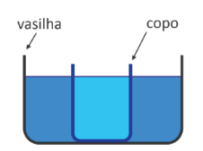
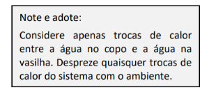
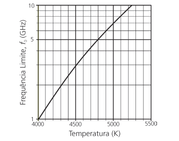
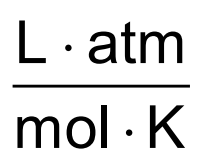
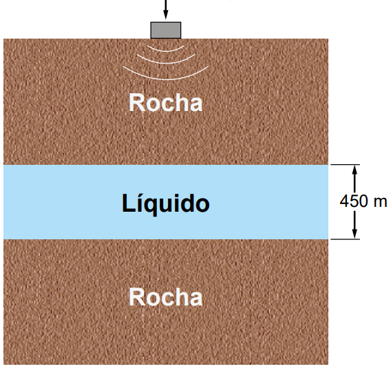

# Questao 1

“Os experimentos de difração e interferência da luz realizados no período de 1800 a 1803, em analogia com os processos de interferência das ondas acústicas, corroboraram a natureza ondulatória da luz. Por outro lado, Einstein introduziu, em 1905, o conceito de fóton, em que cada componente monocromática de frequência 𝑓 da radiação seria equivalente a um sistema de partículas idênticas sem massa, cada qual com energia ℎ𝑓, sendo ℎ≃6,626×10−34 J.s a constante de Planck. A hipótese da existência de fótons só teve ampla aceitação após os experimentos de Compton, em 1922, sobre o espalhamento da radiação eletromagnética na faixa dos raios X por alvos de elementos leves, como o grafite.”

Adaptado de F. Caruso e V. Oguri, Sobre a necessidade do conceito de fóton, RBEF 43, e20210011 (2021).

De acordo com o texto e seus conhecimentos, é correto afirmar:

**Dicas de apoio**
- A luz pode se comportar tanto como onda quanto como partícula, dependendo do experimento.
- A constante de Planck (ℎ) é usada para calcular a energia de um fóton através da fórmula $E = hf$, onde $E$ é a energia e $f$ é a frequência.
- Experimentos de Compton demonstraram o comportamento corpuscular da luz, especialmente em interações com raios X.

**Passo a Passo**
1. Revise os conceitos de natureza ondulatória e corpuscular da luz.
2. Considere o papel dos experimentos de Compton na aceitação da teoria dos fótons.
3. Lembre-se que a energia de um fóton é dada por $E = hf$, onde $h$ é a constante de Planck e $f$ é a frequência.
4. Analise cada alternativa à luz dos conceitos revisados.

Opções de resposta:

A) A radiação eletromagnética apresenta somente comportamento ondulatório.

B) Os experimentos de Compton mostraram que feixes de raios X exibem comportamento corpuscular.

C) A energia de um fóton independe de seu comprimento de onda.

D) A hipótese da natureza corpuscular da radiação está em desacordo com os resultados experimentais.

E) Einstein demonstrou que os experimentos de difração e interferência da luz deveriam estar incorretos.

# Questao 2

Para esfriar um copo contendo 250 mL de água fervente (100°C), é comum utilizar o seguinte método:

Passo 1. Colocar esse copo dentro de uma vasilha em contato com 1 litro de água à 

 temperatura ambiente (25°C), como mostrado na figura.

Passo 2. Esperar que entrem em equilíbrio térmico.

Passo 3. Tirar o copo e trocar a água da vasilha por outro litro de água à temperatura ambiente.

Passo 4. Colocar o copo em contato com a água “nova” e esperar que entrem em equilíbrio térmico.

Após o passo (4) desse método, a temperatura da água no copo será aproximadamente: 

**Dicas de apoio**
- O conceito de equilíbrio térmico é importante: quando dois corpos atingem a mesma temperatura, não há troca de calor entre eles.
- Utilize a fórmula de calor sensível $Q = mcΔT$, onde $Q$ é a quantidade de calor, $m$ é a massa, $c$ é o calor específico e $ΔT$ é a variação de temperatura, para calcular a troca de calor entre a água do copo e a água da vasilha.

**Passo a Passo**
1. Revise o conceito de equilíbrio térmico e como ele afeta a temperatura dos corpos em contato.
2. Considere a capacidade térmica da água e como ela influencia a troca de calor.
3. Lembre-se que a troca de calor entre dois corpos cessa quando eles atingem a mesma temperatura.
4. Calcule a temperatura final considerando o processo de troca de calor em duas etapas.

Opções de resposta:

A) 14°C

B) 28°C

C) 40°C

D) 60°C

E) 84°C

# Questao 3

Os raios cósmicos são fontes de radiação ionizante potencialmente perigosas para o organismo humano. Para quantificar a dose de radiação recebida, utiliza-se o sievert (Sv), definido como a unidade de energia recebida por unidade de massa. A exposição à radiação proveniente de raios cósmicos aumenta com a altitude, o que pode representar um problema para as tripulações de aeronaves. Recentemente, foram realizadas medições acuradas das doses de radiação ionizante para voos entre Rio de Janeiro e Roma. Os resultados têm indicado que a dose média de radiação recebida na fase de cruzeiro (que geralmente representa 80% do tempo total de voo) desse trecho intercontinental é 2 μSv/h. As normas internacionais da aviação civil limitam em 1 000 horas por ano o tempo de trabalho para as tripulações que atuem em voos intercontinentais. Considere que a dose de radiação ionizante para uma radiografia torácica é estimada em 0,2 mSv.

RUAS, A. C. O tripulante de aeronaves e a radiação ionizante. São Paulo: Edição do Autor, 2019 (adaptado).

A quantas radiografias torácicas corresponde a dose de radiação ionizante à qual um tripulante que atue no trecho Rio de Janeiro − Roma é exposto ao longo de um ano?

**Dicas de apoio**
- Para calcular a dose total de radiação recebida em um ano, multiplique a dose por hora pelo número total de horas trabalhadas.
- Converta a dose total de microsieverts (μSv) para milisieverts (mSv) para facilitar a comparação com a dose de uma radiografia torácica.
- Divida a dose anual total pela dose de uma radiografia torácica para encontrar o número equivalente de radiografias.

**Passo a Passo**
1. Calcule a dose total de radiação recebida em um ano, considerando o tempo máximo de voo permitido.
2. Converta a dose total de microsieverts para milisieverts.
3. Compare a dose anual recebida com a dose de uma radiografia torácica para determinar o número de radiografias equivalentes.

Opções de resposta:

A) 8

B) 10

C) 80

D) 100

E) 1 000

# Questao 4

A temperatura extremamente elevada no exterior da cápsula ioniza o ar atmosférico à sua volta. Esses íons blindam a cápsula como uma gaiola de Faraday, impedindo, por alguns minutos, a comunicação por ondas eletromagnéticas de rádio (conversas entre a tripulação e a base na Terra, comandos à distância para ajustes de navegação, etc.). O gráfico da figura a seguir mostra que, quanto maior a temperatura do ar externo, Tar, maior é a frequência limite da onda eletromagnética, f0, abaixo da qual não se pode estabelecer comunicação com a cápsula. Se a temperatura do ar for Tar = 4800 K, qual é o comprimento de onda λ0 correspondente à frequência limite f0?

Dado: Velocidade da luz no vácuo: c = 3,0 ×108 m/S

**Dicas de apoio**
- Utilize a fórmula da velocidade da luz $c = λf$, onde $c$ é a velocidade da luz, $λ$ é o comprimento de onda e $f$ é a frequência, para encontrar o comprimento de onda correspondente à frequência limite.
- Lembre-se de que a frequência e o comprimento de onda são inversamente proporcionais.

**Passo a Passo**
1. Revise a relação entre frequência e comprimento de onda: $c = \, f \cdot \lambda$.
2. Identifique a frequência limite $f_0$ correspondente a $T_{ar} = 4800$ K no gráfico fornecido.
3. Use a fórmula para calcular o comprimento de onda $\lambda_0$ correspondente à frequência $f_0$.

Opções de resposta:

A) 0,06 m.

B) 16,7 m.

C) 0,05 m.

D) 20 m.

# Questao 5

De acordo com a Constituição Federal, é competência dos municípios o gerenciamento dos serviços de limpeza e coleta dos resíduos urbanos (lixo). No entanto, há relatos de que parte desse lixo acaba sendo incinerado, liberando substâncias tóxicas para o ambiente e causando acidentes por explosões, principalmente quando ocorre a incineração de frascos de aerossóis (por exemplo: desodorantes, inseticidas e repelentes). A temperatura elevada provoca a vaporização de todo o conteúdo dentro desse tipo de frasco, aumentando a pressão em seu interior até culminar na explosão da embalagem.

ZVEIBIL, V. Z. et al. Cartilha de limpeza urbana. Disponível em: www.ibam.org.br. Acesso em: 6 jul. 2015 (adaptado).

Suponha um frasco metálico de um aerossol de capacidade igual a 100 mL, contendo 0,1 mol de produtos gasosos à temperatura de 650 °C, no momento da explosão.

Considere: R = 0,082 

A pressão, em atm, dentro do frasco, no momento da explosão, é mais próxima de

**Dicas de apoio**
- Utilize a equação dos gases ideais $PV = nRT$, onde $P$ é a pressão, $V$ é o volume, $n$ é o número de mols, $R$ é a constante universal dos gases e $T$ é a temperatura em Kelvin.
- Converta a temperatura de Celsius para Kelvin somando 273 ao valor em Celsius.
- Lembre-se de converter o volume de mililitros para litros ao usar a equação dos gases ideais.

**Passo a Passo**
1. Revise a equação do gás ideal: $PV = nRT$.
2. Converta a temperatura de Celsius para Kelvin.
3. Substitua os valores conhecidos na equação para encontrar a pressão $P$.

Opções de resposta:

A) 756.

B) 533.

C) 76.

D) 53.

E) 13.

# Questao 6

O manual de um automóvel alerta sobre os cuidados em relação à pressão do ar no interior dos pneus. Recomenda-se que a pressão seja verificada com os pneus frios (à temperatura ambiente). Um motorista, desatento a essa informação, realizou uma viagem longa sobre o asfalto quente e, em seguida, verificou que a pressão **P**₀ no interior dos pneus não era a recomendada pelo fabricante. Na ocasião, a temperatura dos pneus era **T**₀. Após um longo período em repouso, os pneus do carro atingiram a temperatura ambiente **T**. Durante o resfriamento, não há alteração no volume dos pneus e na quantidade de ar no seu interior. Considere o ar dos pneus um gás perfeito (também denominado gás ideal). Durante o processo de resfriamento, os valores de pressão em relação à temperatura (P × T) são representados pelo gráfico:

**Dicas de apoio**
- A relação entre pressão e temperatura para um gás ideal é dada pela lei de Gay-Lussac: $\frac{P}{T} = \text{constante}$, onde $P$ é a pressão e $T$ é a temperatura em Kelvin.
- Quando a temperatura de um gás diminui, sua pressão também diminui, se o volume for constante.
- Analise os gráficos fornecidos para identificar a relação correta entre pressão e temperatura.

**Passo a Passo**
1. Revise a lei dos gases ideais, que relaciona pressão, volume e temperatura: $PV = nRT$.
2. Considere que o volume e a quantidade de gás não mudam durante o resfriamento.
3. Analise como a pressão varia com a temperatura no gráfico fornecido.

Opções de resposta:

A) 

B) 

C) 

D) 

E) 

# Questao 7

Um protótipo de máquina térmica caseira baseia-se num motor de quatro etapas e pode ser construído com o auxílio de uma bomba de bicicleta, uma pequena câmara de pneu e um aquecedor térmico. Na primeira etapa, o gás da câmara de pneu é comprimido adiabaticamente. Na segunda etapa, o gás é aquecido isovolumetricamente. Na terceira etapa, o gás sofre uma expansão adiabática e, finalmente, na quarta etapa, um resfriamento isovolumétrico. Assinale a alternativa que melhor representa o diagrama correspondente a essa máquina térmica no plano pressão (p) x volume (V).

**Dicas de apoio**
- Em um processo adiabático, não há troca de calor com o ambiente. A relação entre pressão e volume é dada por $PV^γ = \text{constante}$, onde $γ$ é o índice adiabático.
- Em um processo isovolumétrico, o volume permanece constante enquanto a pressão pode variar.
- Analise os diagramas fornecidos para identificar as transformações adiabáticas e isovolumétricas.

**Passo a Passo**
1. Revise os conceitos de compressão adiabática e aquecimento isovolumétrico.
2. Considere como a pressão e o volume mudam em cada etapa do ciclo.
3. Analise cada gráfico fornecido para identificar o que representa corretamente as quatro etapas do ciclo.

Opções de resposta:

A) 

B) 

C) 

D) 

E) 

F) 

# Questao 8

Uma cafeteria adotou copos fabricados a partir de uma composição de 50% de plástico reciclado não biodegradável e 50% de casca de café. O copo é reutilizável e retornável, pois o material, semelhante a uma cerâmica, suporta a lavagem. Embora ele seja comercializado por um preço considerado alto quando comparado ao de um copo de plástico descartável, essa cafeteria possibilita aos clientes retornarem o copo sujo e levarem o café quente servido em outro copo já limpo e higienizado. O material desse copo oferece também o conforto de não esquentar na parte externa.

Cafeteria adota copo reutilizável feito com casca de café. Disponível em: www.gazetadopovo.com.br. Acesso em: 5 dez. 2019 (adaptado).

Quais duas vantagens esse copo apresenta em comparação ao copo descartável?

**Dicas de apoio**
- Considere a durabilidade do material semelhante à cerâmica e sua capacidade de ser reutilizado.
- Avalie a baixa condutividade térmica do material, que impede que o copo esquente na parte externa.
- Reflita sobre o impacto ambiental reduzido devido ao uso de material reciclado e casca de café.

**Passo a Passo**
1. Revise as características dos materiais biodegradáveis e não biodegradáveis.
2. Considere as propriedades térmicas do copo reutilizável em comparação ao descartável.
3. Analise as alternativas considerando a durabilidade e o impacto ambiental.

Opções de resposta:

A) Ter a durabilidade de uma cerâmica e ser totalmente biodegradável.

B) Ser tão durável quanto uma cerâmica e ter alta condutividade térmica.

C) Ser um mau condutor térmico e aumentar o resíduo biodegradável na natureza.

D) Ter baixa condutividade térmica e reduzir o resíduo não biodegradável na natureza.

E) Ter alta condutividade térmica e possibilitar a degradação do material no meio ambiente.

# Questao 9

O petróleo é uma matéria-prima muito valiosa e métodos geofísicos são úteis na sua prospecção. É possível identificar a composição de materiais estratificados medindo-se a velocidade de propagação do som (onda mecânica) através deles. Considere que uma camada de 450 m de um líquido se encontra presa no subsolo entre duas camadas rochosas, conforme o esquema. Um pulso acústico (que gera uma vibração mecânica) é emitido a partir da superfície do solo, onde são posteriormente recebidas duas vibrações refletidas (ecos). A primeira corresponde à reflexão do pulso na interface superior do líquido com a camada rochosa. A segunda vibração deve-se à reflexão do pulso na interface inferior. O tempo entre a emissão do pulso e a chegada do primeiro eco é de 0,5 s. O segundo eco chega 1,1 s após a emissão do pulso.

Emissor e detector de pulsos

A velocidade do som na camada líquida, em metro por segundo, é

**Dicas de apoio**
- Utilize a fórmula da velocidade $v = \frac{d}{t}$, onde $v$ é a velocidade, $d$ é a distância e $t$ é o tempo, para calcular a velocidade do som.
- Lembre-se de que o som percorre a distância duas vezes (ida e volta) para cada eco.
- Calcule a velocidade para cada eco separadamente e compare os resultados.

**Passo a Passo**
1. Revise o conceito de velocidade do som e como ela é calculada.
2. Considere a distância percorrida pelo som até a interface superior e de volta.
3. Use a fórmula $v = \frac{d}{t}$ para calcular a velocidade do som na camada líquida.

Opções de resposta:

A) 270.

B) 540.

C) 818.

D) 1 500.

E) 1 800

# Questao 10

Um experimento de demonstração sobre ondas estacionárias faz uso de uma canaleta disposta horizontalmente, contendo grãos de areia fina e seca. Abaixo da canaleta, posiciona-se um alto-falante que transmite um som, produzindo, na canaleta, uma vibração, associada a uma onda estacionária com um comprimento de onda bem definido. O diagrama representa uma imagem digitalizada dos grãos de areia depositados na base da canaleta em um certo instante. Utilize a régua da figura, graduada em centímetros, para assinalar a alternativa que apresenta a melhor aproximação para o valor do comprimento de onda da vibração em questão.

**Dicas de apoio**
- Ondas estacionárias apresentam nós e ventres. Os nós são pontos de mínima amplitude onde os grãos de areia se acumulam.
- Meça a distância entre dois nós consecutivos para encontrar o comprimento de onda.
- Utilize a régua fornecida na imagem para medir com precisão.

**Passo a Passo**
1. Revise o conceito de ondas estacionárias e como o comprimento de onda é determinado.
2. Observe a distribuição dos grãos de areia e como eles se acumulam nos nós da onda.
3. Use a régua fornecida para medir a distância entre os nós e determinar o comprimento de onda.

Opções de resposta:

A) 1,2 cm

B) 5,1 cm

C) 6,8 cm

D) 11,3 cm

E) 18,1 cm

