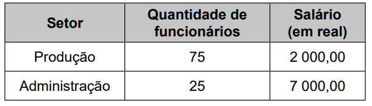
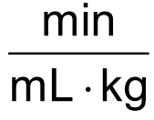
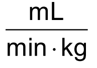
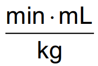
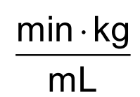
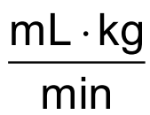

# Questao 1

Questão - 1

Bill Amend, FoxTrot. Disponível em: https://gocomics.com/.

A tirinha acima fala a respeito de um baralho de 52 cartas dividido, igualmente, em quatro naipes: heart, diamonds, club e spade, sendo os naipes representados por símbolos, conforme a figura abaixo. Além disso, cada naipe é composto por nove cartas numéricas, de 2 a 10, três cartas com figuras humanas e uma carta do símbolo Ás.

Gambling and symbols on various cards, heart diamonds club and spade. Disponível em: https://www.vecteezy.com/.

A partir dessas informações, considere as probabilidades do “mágico” acertar qual é a carta que a participante do truque escolheu, logo após cada pergunta ser respondida.

**Dicas de apoio**
- Lembre-se que a probabilidade é calculada dividindo o número de eventos favoráveis pelo número total de eventos possíveis.
- Considere que cada resposta dada na tirinha elimina algumas cartas, aumentando a probabilidade de acerto.
- Tente calcular a probabilidade antes e depois de cada resposta para identificar o maior aumento.

**Passo a Passo**
1. Revise a estrutura de um baralho de 52 cartas, com 4 naipes e as cartas que compõem cada naipe.
2. Analise cada quadro da tirinha para entender quais perguntas foram feitas e como elas afetam as probabilidades.
3. Calcule a probabilidade inicial de acertar a carta antes de qualquer pergunta ser feita.
4. Para cada pergunta, determine como a resposta (sim ou não) altera o conjunto de cartas possíveis.
5. Calcule a nova probabilidade após cada pergunta.
6. Compare as probabilidades para encontrar o maior aumento absoluto entre duas perguntas consecutivas.
7. Deixe o cálculo final para determinar o aumento exato a cargo do aluno.

Considerando os sete primeiros quadros da tirinha, de uma pergunta para a outra, o maior aumento absoluto obtido nas chances de acerto foi de aproximadamente

Opções de resposta:

A) 1,29%.

B) 2,56%.

C) 10,00%.

D) 13,33%.

E) 33,33%.

# Questao 2

**Questão 2**

A música é uma paixão de quase todas as pessoas, independente do estilo que cada um prefere, é fato que uma boa música é sempre agradável aos ouvidos. Sabe-se que em uma emissora de rádio, um dos programas de maior audiência é o programa que toca sucessos de todos os tempos, desde rock, mpb e blues. Considere que para a programação de amanhã o apresentador tenha selecionado 10 músicas do estilo rock, 5 do estilo mpb, 4 do estilo blues e que não haverá mistura de estilos na sequência de execução das músicas.

**Dicas de apoio**
- Para calcular o número de sequências distintas, use o conceito de fatorial, que é o produto de todos os números inteiros positivos até um certo número.
- Lembre-se que a sequência de músicas de cada estilo pode ser organizada de várias maneiras, e o total de sequências é o produto dos arranjos de cada estilo.

**Passo a Passo**
1. Revise o conceito de permutação, que é a rearranjo de elementos em uma sequência.
2. Considere que as músicas de cada estilo são distintas entre si.
3. Calcule o número de permutações para cada estilo de música separadamente.
4. Multiplique as permutações dos diferentes estilos para encontrar o total de sequências possíveis.
5. Deixe a escolha da expressão correta a cargo do aluno.

O número de sequências distintas pode ser calculado por qual destas expressões?

Opções de resposta:

A) 10! · 5! · 4!

B) 10! + 5! + 4!

C) 10! · 5! · 4! · 3!

D) 10! + 5! + 4! + 3!

E) 19!

# Questao 3

**Questão 3**

Analisando as vendas de uma empresa, o gerente concluiu que o montante diário arrecadado, em milhar de real, poderia ser calculado pela expressão $V(x) = \frac{x^2}{4} - 10x + 105$, em que os valores de x representam os dias do mês, variando de 1 a 30.

Um dos fatores para avaliar o desempenho mensal da empresa é verificar qual é o menor montante diário V0 arrecadado ao longo do mês e classificar o desempenho conforme as categorias apresentadas a seguir, em que as quantidades estão expressas em milhar de real.

• Ótimo: V0 ≥ 24

• Bom: 20 ≤ V0 < 24

• Normal: 10 ≤ V0 < 20

• Ruim: 4 ≤ V0 < 10

• Péssimo: V0 < 4

**Dicas de apoio**
- A expressão dada é uma função quadrática, que tem a forma geral $ax^2 + bx + c$.
- O valor mínimo de uma função quadrática pode ser encontrado no vértice da parábola, que é dado por $x = -\frac{b}{2a}$.
- Substitua o valor de $x$ encontrado na expressão para calcular o menor montante diário.

**Passo a Passo**
1. Revise a expressão dada para calcular o montante diário: $V(x) = \frac{x^2}{4} - 10x + 105$.
2. Substitua os valores de x de 1 a 30 na expressão para encontrar o montante diário V(x) para cada dia.
3. Identifique o menor valor de V(x) obtido ao longo do mês.
4. Compare o menor valor encontrado com as categorias de desempenho fornecidas.
5. Deixe a classificação final a cargo do aluno.

No caso analisado, qual seria a classificação do desempenho da empresa?

Opções de resposta:

A) Ótimo.

B) Bom.

C) Normal.

D) Ruim.

E) Péssimo.

# Questao 4

**Questão 4**

Os números figurados pentagonais provavelmente foram introduzidos pelos pitagóricos por volta do século V a.C. As figuras ilustram como obter os seis primeiros deles, sendo os demais obtidos seguindo o mesmo padrão geométrico.

**Dicas de apoio**
- Os números pentagonais são uma sequência de números que podem ser representados por pontos dispostos em forma de pentágono.
- A fórmula para calcular o n-ésimo número pentagonal é $P_n = \frac{3n^2 - n}{2}$.
- Substitua $n = 8$ na fórmula para encontrar o oitavo número pentagonal.

**Passo a Passo**
1. Revise o conceito de números figurados pentagonais e como eles são formados.
2. Observe a imagem fornecida para identificar o padrão de formação dos números pentagonais.
3. Use a fórmula do número pentagonal: $P_n = \frac{3n^2 - n}{2}$, onde n é a posição do número na sequência.
4. Substitua n = 8 na fórmula para calcular o oitavo número pentagonal.
5. Deixe o cálculo final para encontrar o valor exato a cargo do aluno.

O oitavo número pentagonal é

Opções de resposta:

A) 59.

B) 83.

C) 86.

D) 89.

E) 92.

# Questao 5

**Questão 5**

Um agricultor é informado sobre um método de proteção para sua lavoura que consiste em inserir larvas específicas, de rápida reprodução. A reprodução dessas larvas faz com que sua população multiplique-se por 10 a cada 3 dias e, para evitar eventuais desequilíbrios, é possível cessar essa reprodução aplicando-se um produto X. O agricultor decide iniciar esse método com 100 larvas e dispõe de 5 litros do produto X, cuja aplicação recomendada é de exatamente 1 litro para cada população de 200 000 larvas. A quantidade total do produto X de que ele dispõe deverá ser aplicada de uma única vez.

**Dicas de apoio**
- A população de larvas cresce exponencialmente, multiplicando por 10 a cada 3 dias.
- Use a fórmula para crescimento exponencial: $P(t) = P_0 \times r^{(t/T)}$, onde $P_0$ é a população inicial, $r$ é a taxa de crescimento e $T$ é o tempo necessário para a taxa de crescimento.
- Calcule o tempo necessário para que a população atinja 1.000.000 de larvas, pois 5 litros de produto são necessários para essa quantidade.

**Passo a Passo**
1. Revise o conceito de crescimento exponencial e como ele se aplica à reprodução das larvas.
2. Calcule a população de larvas a cada intervalo de 3 dias, começando com 100 larvas.
3. Determine em quantos dias a população de larvas atingirá 1 000 000, já que 5 litros de produto X são necessários para essa quantidade.
4. Deixe o cálculo final para determinar o dia exato a cargo do aluno.

Quantos dias após iniciado esse método o agricultor deverá aplicar o produto X?

Opções de resposta:

A) 2

B) 4

C) 6

D) 12

E) 18

# Questao 6

**Questão 6**

Um controlador de voo dispõe de um instrumento que descreve a altitude de uma aeronave em voo, em função da distância em solo. Essa distância em solo é a medida na horizontal entre o ponto de origem do voo até o ponto que representa a projeção ortogonal da posição da aeronave, em voo, no solo. Essas duas grandezas são dadas numa mesma unidade de medida.

A tela do instrumento representa proporcionalmente as dimensões reais das distâncias associadas ao voo.

A figura apresenta a tela do instrumento depois de concluída a viagem de um avião, sendo a medida do lado de cada quadradinho da malha igual a 1 cm.

Essa tela apresenta os dados de um voo cuja maior altitude alcançada foi de 5 km.

**Dicas de apoio**
- A escala de um mapa ou desenho é a razão entre uma medida no desenho e a medida real correspondente.
- Para encontrar a escala, divida a maior altitude real pela medida correspondente na tela.
- Lembre-se de que cada quadradinho na tela representa 1 cm.

**Passo a Passo**
1. Revise o conceito de escala e como ela é usada para representar medidas reais em uma tela ou mapa.
2. Observe a imagem fornecida para identificar a relação entre a medida na tela e a medida real.
3. Calcule a escala comparando a maior altitude na tela com a altitude real de 5 km.
4. Deixe a determinação da escala exata a cargo do aluno.

A escala em que essa tela representa as medidas reais é

Opções de resposta:

A) 1 : 5.

B) 1 : 11.

C) 1 : 55.

D) 1 : 5 000.

E) 1 : 500 000.

# Questao 7

**Questão 7**

Os 100 funcionários de uma empresa estão distribuídos em dois setores: Produção e Administração. Os funcionários de um mesmo setor recebem salários com valores iguais. O quadro apresenta a quantidade de funcionários por setor e seus respectivos salários. 

**Dicas de apoio**
- A média salarial é calculada somando-se todos os salários e dividindo pelo número total de funcionários.
- Multiplique o número de funcionários pelo salário correspondente em cada setor para encontrar o total pago a cada setor.
- Some os totais de cada setor e divida por 100 para encontrar a média salarial.

**Passo a Passo**
1. Revise o conceito de média aritmética e como ela é calculada.
2. Use a tabela fornecida para identificar a quantidade de funcionários e o salário em cada setor.
3. Calcule o salário total pago em cada setor multiplicando o número de funcionários pelo salário.
4. Some os salários totais de ambos os setores para encontrar o salário total da empresa.
5. Divida o salário total pelo número total de funcionários para encontrar a média salarial.
6. Deixe o cálculo final da média exata a cargo do aluno.

A média dos salários dos 100 funcionários dessa empresa, em real, é

Opções de resposta:

A) 2 000,00.

B) 2 500,00.

C) 3 250,00.

D) 4 500,00.

E) 9 000,00.

# Questao 8

**Questão 8**

Entre maratonistas, um parâmetro utilizado é o de economia de corrida (EC). O valor desse parâmetro é calculado pela razão entre o consumo de oxigênio, em mililitro (mL) por minuto (min), e a massa, em quilograma (kg), do atleta correndo a uma velocidade constante.

Disponível em: www.treinamentoonline.com.br. Acesso em: 23 out. 2019 (adaptado).

Um maratonista, visando melhorar sua performance, auxiliado por um médico, mensura o seu consumo de oxigênio por minuto a velocidade constante. Com base nesse consumo e na massa do atleta, o médico calcula o EC do atleta.

**Dicas de apoio**
- A unidade de medida é encontrada dividindo-se as unidades de consumo de oxigênio pela massa do atleta.
- Lembre-se que a razão é uma divisão entre duas grandezas.
- Verifique as unidades de cada opção para identificar a correta.

**Passo a Passo**
1. Revise a definição de economia de corrida (EC) e como ela é calculada.
2. Identifique as unidades de medida envolvidas: mililitros (mL), minutos (min), e quilogramas (kg).
3. Calcule a razão entre o consumo de oxigênio e a massa do atleta para determinar a unidade de EC.
4. Deixe a escolha da unidade correta a cargo do aluno.

A unidade de medida da grandeza descrita pelo parâmetro EC é

Opções de resposta:

A) 

B) 

C) 

D) 

E) 

# Questao 9

**Questão 9**

Um pescador tem um custo fixo diário de R$ 900,00 com combustível, iscas, manutenção de seu barco e outras pequenas despesas. Ele vende cada quilograma de peixe por R$ 5,00. Sua meta é obter um lucro mínimo de R$ 800,00 por dia. Sozinho, ele consegue, ao final de um dia de trabalho, pescar 180 kg de peixe, o que é suficiente apenas para cobrir o custo fixo diário. Portanto, precisa contratar ajudantes, pagando para cada um R$ 250,00 por dia de trabalho. Além desse valor, 4% da receita obtida pela venda de peixe é repartida igualmente entre os ajudantes. Considerando o tamanho de seu barco, ele pode contratar até 5 ajudantes. Ele sabe que com um ajudante a pesca diária é de 300 kg e que, a partir do segundo ajudante contratado, aumenta-se em 100 kg a quantidade de peixe pescada por ajudante em um dia de trabalho.

**Dicas de apoio**
- Calcule a receita total multiplicando o total de quilos de peixe pescados pelo preço por quilo.
- Subtraia o custo fixo e os custos com ajudantes da receita total para encontrar o lucro.
- Lembre-se de incluir os 4% da receita que é dividida entre os ajudantes.

**Passo a Passo**
1. Revise o conceito de lucro e como ele é calculado.
2. Calcule a receita total para diferentes quantidades de ajudantes, considerando o aumento na quantidade de peixe pescada.
3. Subtraia os custos fixos e os custos com ajudantes da receita total para encontrar o lucro.
4. Compare o lucro obtido com a meta de R$ 800,00.
5. Deixe a determinação do número mínimo de ajudantes a cargo do aluno.

A quantidade mínima de ajudantes que esse pescador precisa contratar para conseguir o lucro diário pretendido é

Opções de resposta:

A) 1.

B) 2.

C) 3.

D) 4.

E) 5.

# Questao 10

**Questão 10**

Uma pessoa caminha por 30 minutos e utiliza um aplicativo instalado em seu celular para monitorar a variação da intensidade do sinal de internet recebido pelo aparelho durante o deslocamento. Chegando ao seu destino, o aplicativo forneceu este gráfico: 

**Dicas de apoio**
- Observe o gráfico e identifique os intervalos de tempo em que a intensidade do sinal é zero.
- Some os intervalos de tempo em que o sinal está ausente para encontrar o total de minutos sem sinal.

**Passo a Passo**
1. Revise o gráfico fornecido para entender a relação entre o tempo e a intensidade do sinal de internet.
2. Identifique os intervalos de tempo em que a intensidade do sinal é zero.
3. Some os minutos correspondentes a esses intervalos para encontrar o tempo total sem sinal.
4. Deixe a soma final dos minutos a cargo do aluno.

Por quantos minutos, durante essa caminhada, o celular dessa pessoa ficou sem receber sinal de internet?

Opções de resposta:

A) 6

B) 8

C) 10

D) 14

E) 24

