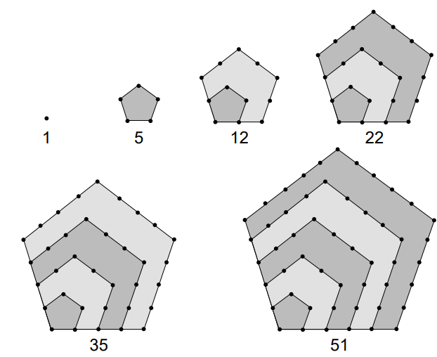
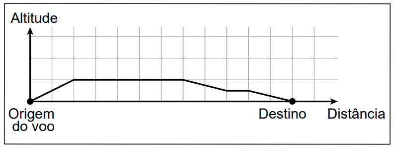
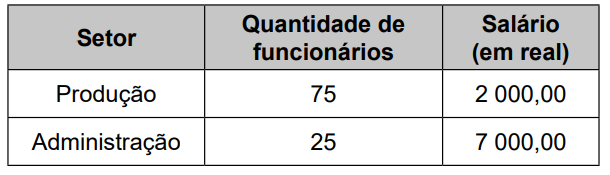
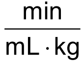
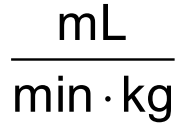
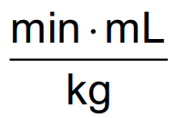
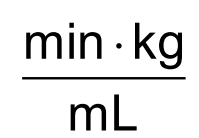
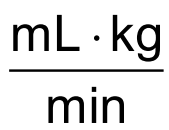
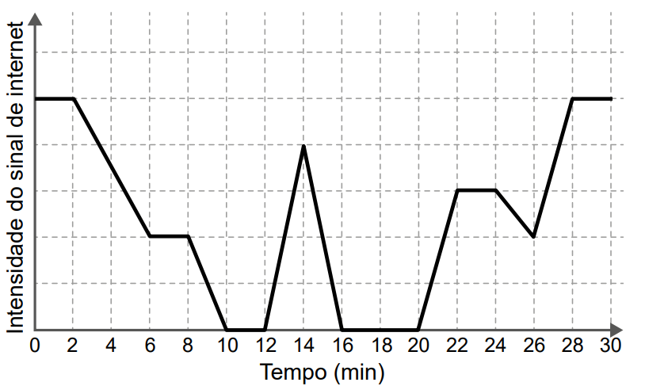

# Questao 1

**Questão 1**

Bill Amend, FoxTrot. Disponível em: https://gocomics.com/.

A tirinha acima fala sobre um baralho de 52 cartas, dividido igualmente em quatro naipes: heart, diamonds, club e spade. Cada naipe tem nove cartas numéricas (2 a 10), três cartas com figuras e uma carta Ás.

Gambling and symbols on various cards, heart diamonds club and spade. Disponível em: https://www.vecteezy.com/.

Com base nessas informações, considere as chances do "mágico" acertar a carta escolhida pela participante após cada pergunta.

**Dicas de apoio**
- Lembre-se que a probabilidade de um evento ocorrer é calculada pela razão entre o número de casos favoráveis e o número total de casos possíveis.
- Considere que cada pergunta respondida reduz o número de cartas possíveis, aumentando a probabilidade de acerto.
- Revise os conceitos de probabilidade condicional, que podem ser úteis para entender como cada resposta influencia as chances de acerto.

**Passo a Passo**
1. Revise a tirinha para entender como as perguntas eliminam possibilidades de cartas.
2. Liste as perguntas feitas e as respostas dadas (sim ou não) para cada uma.
3. Calcule a probabilidade inicial de acertar a carta antes de qualquer pergunta.
4. Após cada pergunta, reavalie a quantidade de cartas possíveis e calcule a nova probabilidade.
5. Compare as probabilidades para identificar o maior aumento absoluto entre duas perguntas consecutivas.

**Nos sete primeiros quadros da tirinha, o maior aumento absoluto nas chances de acerto foi de aproximadamente**

Opções de resposta:

A) 1,29%.

B) 2,56%.

C) 10,00%.

D) 13,33%.

E) 33,33%.

# Questao 2

Este texto apresenta um problema a ser resolvido. Leia-o com atenção.

A música é uma paixão de quase todas as pessoas, independente do estilo que cada um prefere, é fato que uma boa música é sempre agradável aos ouvidos. Sabe-se que em uma emissora de rádio, um dos programas de maior audiência é o programa que toca sucessos de todos os tempos, desde rock, mpb e blues. Considere que para a programação de amanhã o apresentador tenha selecionado 10 músicas do estilo rock, 5 do estilo mpb, 4 do estilo blues e que não haverá mistura de estilos na sequência de execução das músicas.

**Dicas de apoio**
- Para calcular o número de sequências distintas, utilize o conceito de permutação, que é dado por $n!$, onde $n$ é o número de elementos a serem permutados.
- Neste caso, as músicas de cada estilo podem ser permutadas entre si, portanto, considere a permutação de cada grupo de músicas separadamente.
- A expressão correta para o número de sequências distintas será o produto das permutações de cada grupo.

**Passo a Passo**
1. Identifique o total de músicas de cada estilo.
2. Lembre-se que a ordem das músicas dentro de cada estilo importa.
3. Use o conceito de permutação para calcular as sequências possíveis de cada estilo.
4. Multiplique as permutações de cada estilo para encontrar o total de sequências distintas.

O número de sequências distintas pode ser calculado por qual destas expressões?

Opções de resposta:

A) 10! · 5! · 4!

B) 10! + 5! + 4!

C) 10! · 5! · 4! · 3!

D) 10! + 5! + 4! + 3!

E) 19!

# Questao 3

Analisando as vendas de uma empresa, o gerente concluiu que o montante diário arrecadado, em milhar de real, poderia ser calculado pela expressão $V(x) = \frac{x^2}{4} - 10x + 105$, em que os valores de x representam os dias do mês, variando de 1 a 30.

**Dicas de apoio**
- A expressão dada é uma função quadrática, da forma $V(x) = \frac{x^2}{4} - 10x + 105$. Para encontrar o menor valor, você pode calcular o vértice da parábola.
- O vértice de uma parábola $ax^2 + bx + c$ pode ser encontrado usando a fórmula $x = -\frac{b}{2a}$.
- Substitua o valor de $x$ encontrado na expressão para calcular o valor mínimo de $V(x)$.

**Passo a Passo**
1. Substitua os valores de x de 1 a 30 na expressão dada para encontrar V(x).
2. Identifique o menor valor de V(x) obtido.
3. Use a classificação fornecida para determinar a categoria correspondente ao menor valor encontrado.

Um dos fatores para avaliar o desempenho mensal da empresa é verificar qual é o menor montante diário V0 arrecadado ao longo do mês e classificar o desempenho conforme as categorias apresentadas a seguir, em que as quantidades estão expressas em milhar de real.

• Ótimo: V0 ≥ 24

• Bom: 20 ≤ V0 < 24

• Normal: 10 ≤ V0 < 20

• Ruim: 4 ≤ V0 < 10

• Péssimo: V0 < 4

No caso analisado, qual seria a classificação do desempenho da empresa?

Opções de resposta:

A) Ótimo.

B) Bom.

C) Normal.

D) Ruim.

E) Péssimo.

# Questao 4

Os números figurados pentagonais provavelmente foram introduzidos pelos pitagóricos por volta do século V a.C. As figuras ilustram como obter os seis primeiros deles, sendo os demais obtidos seguindo o mesmo padrão geométrico.

**Dicas de apoio**
- Os números pentagonais são uma sequência de números figurados que podem ser visualizados como pontos dispostos em forma de pentágonos.
- A fórmula para calcular o n-ésimo número pentagonal é $P_n = \frac{3n^2 - n}{2}$.
- Substitua o valor de $n$ pela posição desejada na sequência para encontrar o número pentagonal correspondente.

**Passo a Passo**
1. Observe o padrão geométrico apresentado na imagem para os números pentagonais.
2. Identifique a sequência numérica dos números pentagonais dados.
3. Use a fórmula do número pentagonal $P_n = \frac{3n^2 - n}{2}$ para calcular o oitavo número pentagonal.

O oitavo número pentagonal é

Opções de resposta:

A) 59.

B) 83.

C) 86.

D) 89.

E) 92.

# Questao 5

Um agricultor é informado sobre um método de proteção para sua lavoura que consiste em inserir larvas específicas, de rápida reprodução. A reprodução dessas larvas faz com que sua população multiplique-se por 10 a cada 3 dias e, para evitar eventuais desequilíbrios, é possível cessar essa reprodução aplicando-se um produto X. O agricultor decide iniciar esse método com 100 larvas e dispõe de 5 litros do produto X, cuja aplicação recomendada é de exatamente 1 litro para cada população de 200 000 larvas. A quantidade total do produto X de que ele dispõe deverá ser aplicada de uma única vez.

**Dicas de apoio**
- A população de larvas cresce exponencialmente, multiplicando-se por 10 a cada 3 dias. Use a fórmula $P(t) = P_0 \times 10^{(t/3)}$, onde $P_0$ é a população inicial e $t$ é o tempo em dias.
- Calcule o tempo necessário para que a população alcance 1 000 000 de larvas, já que 5 litros são necessários para essa quantidade.
- Lembre-se de que a aplicação deve ser feita assim que a população atingir ou exceder o número necessário.

**Passo a Passo**
1. Calcule o crescimento da população de larvas a cada 3 dias.
2. Determine em quantos dias a população de larvas atingirá 1 000 000, já que 5 litros de produto são suficientes para essa quantidade.
3. Verifique o número de ciclos de 3 dias necessários para atingir essa população.

Quantos dias após iniciado esse método o agricultor deverá aplicar o produto X?

Opções de resposta:

A) 2

B) 4

C) 6

D) 12

E) 18

# Questao 6

Um controlador de voo dispõe de um instrumento que descreve a altitude de uma aeronave em voo, em função da distância em solo. Essa distância em solo é a medida na horizontal entre o ponto de origem do voo até o ponto que representa a projeção ortogonal da posição da aeronave, em voo, no solo. Essas duas grandezas são dadas numa mesma unidade de medida.

A tela do instrumento representa proporcionalmente as dimensões reais das distâncias associadas ao voo.

A figura apresenta a tela do instrumento depois de concluída a viagem de um avião, sendo a medida do lado de cada quadradinho da malha igual a 1 cm.

**Dicas de apoio**
- A escala é a razão entre a medida no desenho e a medida real. Se a maior altitude é de 5 km e corresponde a uma certa medida na tela, use essa relação para encontrar a escala.
- Converta as unidades de medida, se necessário, para que estejam na mesma unidade antes de calcular a escala.
- A escala pode ser expressa na forma 1 : n, onde n é o fator de redução ou ampliação.

**Passo a Passo**
1. Observe a figura e conte o número de quadradinhos que representam a altitude de 5 km.
2. Calcule a escala comparando a medida em quadradinhos com a medida real em km.
3. Expresse a escala na forma de razão 1 : n.

Essa tela apresenta os dados de um voo cuja maior altitude alcançada foi de 5 km.

A escala em que essa tela representa as medidas reais é

Opções de resposta:

A) 1 : 5.

B) 1 : 11.

C) 1 : 55.

D) 1 : 5 000.

E) 1 : 500 000.

# Questao 7

Os 100 funcionários de uma empresa estão distribuídos em dois setores: Produção e Administração. Os funcionários de um mesmo setor recebem salários com valores iguais. O quadro apresenta a quantidade de funcionários por setor e seus respectivos salários. 

 

**Dicas de apoio**
- A média salarial é calculada pela soma dos salários de todos os funcionários dividida pelo número total de funcionários.
- Multiplique o número de funcionários de cada setor pelo respectivo salário para encontrar o total pago a cada setor.
- Some os totais de cada setor e divida pelo número total de funcionários para encontrar a média.

**Passo a Passo**
1. Identifique o número de funcionários e o salário em cada setor a partir da tabela.
2. Calcule o total de salários pagos em cada setor.
3. Some os totais de salários dos dois setores e divida pelo número total de funcionários para encontrar a média salarial.

A média dos salários dos 100 funcionários dessa empresa, em real, é

Opções de resposta:

A) 2 000,00.

B) 2 500,00.

C) 3 250,00.

D) 4 500,00.

E) 9 000,00.

# Questao 8

Entre maratonistas, um parâmetro utilizado é o de economia de corrida (EC). O valor desse parâmetro é calculado pela razão entre o consumo de oxigênio, em mililitro (mL) por minuto (min), e a massa, em quilograma (kg), do atleta correndo a uma velocidade constante.

Disponível em: www.treinamentoonline.com.br. Acesso em: 23 out. 2019 (adaptado).

**Dicas de apoio**
- A unidade de medida do EC é obtida dividindo a unidade de consumo de oxigênio (mL/min) pela unidade de massa (kg).
- Simplifique a expressão para encontrar a unidade correta: $
frac{mL}{min \times kg}$.
- Revise as opções de resposta para identificar a unidade que corresponde à simplificação correta.

**Passo a Passo**
1. Revise a definição de economia de corrida (EC) dada no enunciado.
2. Identifique as unidades de medida envolvidas na razão (mL, min, kg).
3. Escreva a unidade de EC como uma fração envolvendo as unidades identificadas.

A unidade de medida da grandeza descrita pelo parâmetro EC é

Opções de resposta:

A) 

B) 

C) 

D) 

E) 

# Questao 9

Um pescador tem um custo fixo diário de R$ 900,00 com combustível, iscas, manutenção de seu barco e outras pequenas despesas. Ele vende cada quilograma de peixe por R$ 5,00. Sua meta é obter um lucro mínimo de R$ 800,00 por dia. Sozinho, ele consegue, ao final de um dia de trabalho, pescar 180 kg de peixe, o que é suficiente apenas para cobrir o custo fixo diário. Portanto, precisa contratar ajudantes, pagando para cada um R$ 250,00 por dia de trabalho. Além desse valor, 4% da receita obtida pela venda de peixe é repartida igualmente entre os ajudantes. Considerando o tamanho de seu barco, ele pode contratar até 5 ajudantes. Ele sabe que com um ajudante a pesca diária é de 300 kg e que, a partir do segundo ajudante contratado, aumenta-se em 100 kg a quantidade de peixe pescada por ajudante em um dia de trabalho.

**Dicas de apoio**
- Calcule a receita total obtida pela venda de peixe, multiplicando o preço por quilograma pela quantidade total pescada.
- Subtraia o custo fixo e o custo dos ajudantes da receita total para encontrar o lucro.
- Lembre-se de incluir os 4% da receita que são divididos entre os ajudantes no cálculo do custo total dos ajudantes.

**Passo a Passo**
1. Calcule a receita total obtida pela venda de peixes com diferentes números de ajudantes.
2. Subtraia os custos fixos e os custos dos ajudantes da receita total para encontrar o lucro.
3. Determine o número mínimo de ajudantes necessário para atingir o lucro desejado.

A quantidade mínima de ajudantes que esse pescador precisa contratar para conseguir o lucro diário pretendido é

Opções de resposta:

A) 1.

B) 2.

C) 3.

D) 4.

E) 5.

# Questao 10

Uma pessoa caminha por 30 minutos e utiliza um aplicativo instalado em seu celular para monitorar a variação da intensidade do sinal de internet recebido pelo aparelho durante o deslocamento. Chegando ao seu destino, o aplicativo forneceu este gráfico: 

 

**Dicas de apoio**
- Observe o gráfico para identificar os intervalos de tempo em que a intensidade do sinal é zero.
- Some os minutos correspondentes a esses intervalos para encontrar o tempo total sem sinal.
- Certifique-se de considerar corretamente o eixo do tempo ao fazer a contagem.

**Passo a Passo**
1. Analise o gráfico para identificar os intervalos de tempo em que o sinal de internet está ausente.
2. Some os minutos correspondentes a esses intervalos para encontrar o tempo total sem sinal.
3. Verifique se o tempo total calculado corresponde a uma das opções de resposta.

Por quantos minutos, durante essa caminhada, o celular dessa pessoa ficou sem receber sinal de internet?

Opções de resposta:

A) 6

B) 8

C) 10

D) 14

E) 24

