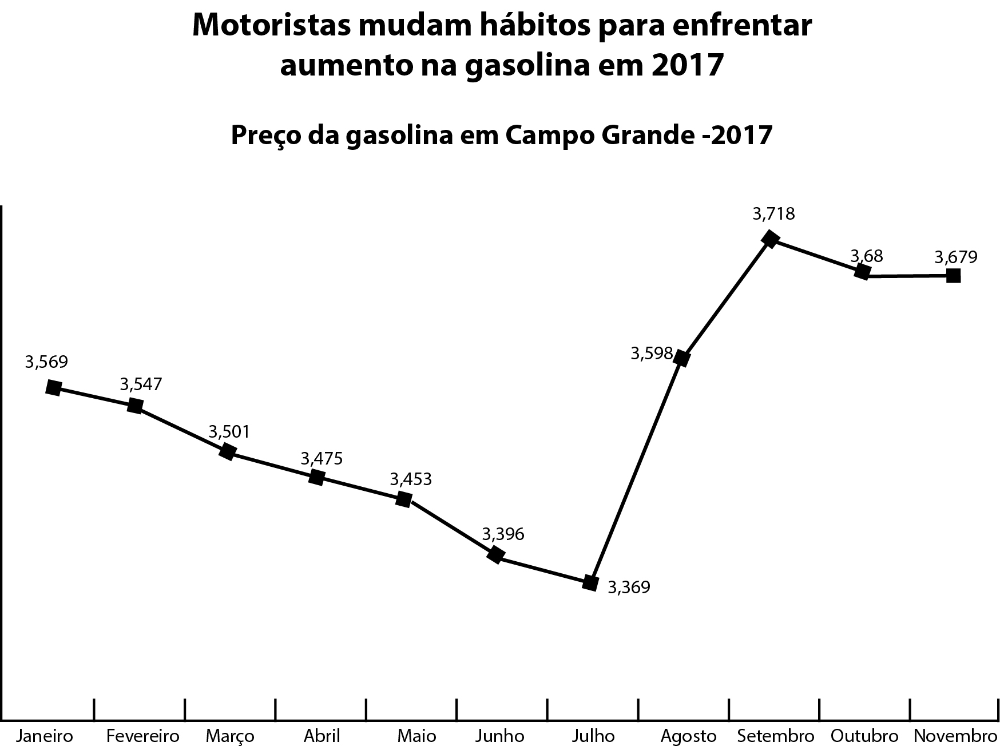
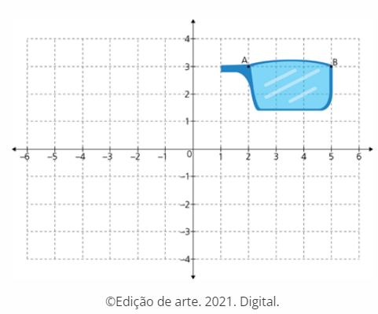
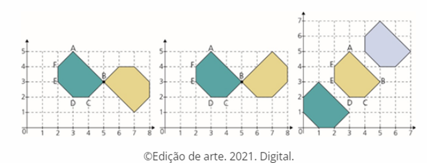
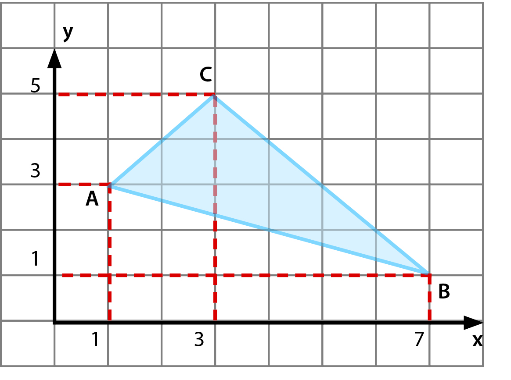
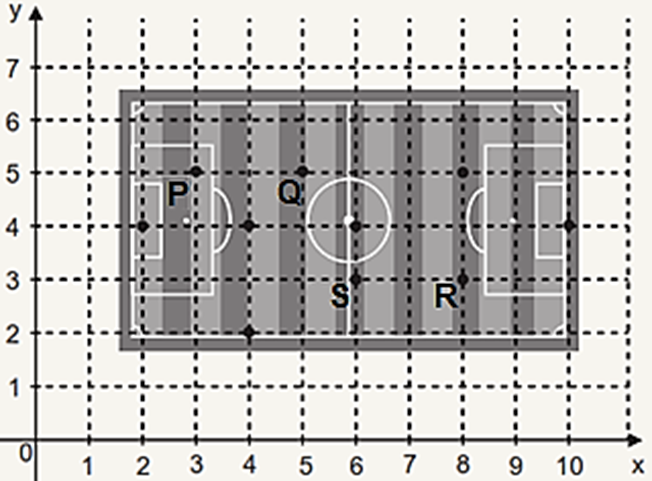
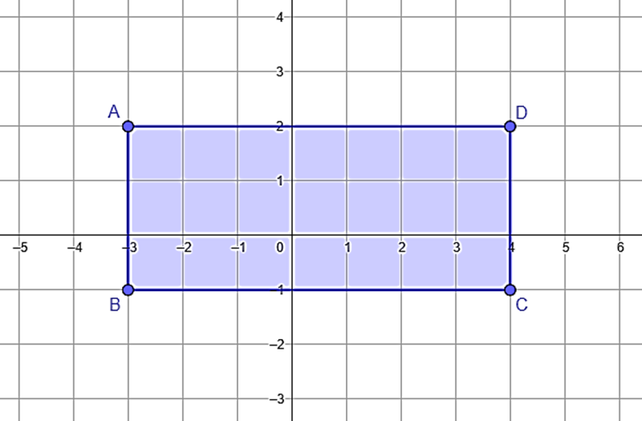
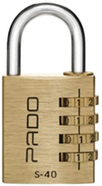

# Questao 1

39) O gráfico apresenta a variação de preço na gasolina nos meses de janeiro a novembro de 2017.

Disponível em: . Acesso em: 24 jun. 2018.

Com base no gráfico, qual foi a diferença entre o maior e o menor preço da gasolina?

**Dicas de apoio**
- A amplitude é a diferença entre o maior e o menor valor de um conjunto de dados.
- No gráfico, identifique o maior e o menor preço da gasolina para calcular a amplitude.

**Passo a Passo**
1. Observe o gráfico e identifique os preços máximo e mínimo da gasolina ao longo do período.
2. Lembre-se que a amplitude é a diferença entre o valor máximo e o valor mínimo.
3. Subtraia o menor valor do maior valor para encontrar a amplitude.
4. Compare o resultado com as opções de resposta.

Opções de resposta:

A) 0,349.

B) 0,310.

C) 0,200.

D) 0,110.

# Questao 2

Questão - 2

Fábio tem cinco camisas: uma preta de mangas curtas, uma preta de mangas compridas, uma azul, uma cinza e uma branca, e quatro calças: uma preta, uma azul, uma verde e uma marrom. Quantas combinações diferentes ele pode fazer usando uma camisa e uma calça de cores diferentes?

**Dicas de apoio**
- Para calcular as combinações, multiplique o número de opções de camisas pelo número de opções de calças.
- Lembre-se de subtrair as combinações onde a camisa e a calça têm a mesma cor.

**Passo a Passo**
1. Liste todas as camisas e calças disponíveis.
2. Para cada camisa, identifique as calças que têm cores diferentes.
3. Conte quantas combinações são possíveis para cada camisa.
4. Some todas as combinações para encontrar o total.

Opções de resposta:

A) 12

B) 15

C) 17

D) 18

E) 20

# Questao 3

31. Kaylan foi desafiado pelo colega de classe a desenhar o simétrico de uma figura no plano cartesiano. Ele percebeu que, para isso, bastava desenhar a outra metade dos óculos. 

 Em qual quadrante no plano cartesiano se encontrará a outra metade dos óculos?

**Dicas de apoio**
- A simetria no plano cartesiano pode ser feita em relação aos eixos X ou Y.
- Identifique o eixo de simetria e observe em qual quadrante a figura original está para determinar onde a figura simétrica estará.

**Passo a Passo**
1. Identifique em qual quadrante a parte existente da figura está localizada.
2. Lembre-se que a simetria em relação a um eixo implica que a figura será refletida para o quadrante oposto.
3. Determine qual quadrante é o oposto ao quadrante atual da figura.
4. Verifique as opções de resposta para encontrar a correta.

Opções de resposta:

A) 1º quadrante

B) 2º quadrante

C) 3º quadrante

D) 4º quadrante

# Questao 4

Questão - 4

31- O polígono ABCDEF representado nas imagens sofreu algumas transformações geométricas. Observe as transformações realizadas em cada uma das imagens

As transformações realizadas foram, respectivamente:

**Dicas de apoio**
- Rotação: movimento circular em torno de um ponto.
- Translação: deslocamento de uma figura sem alterar sua orientação.
- Reflexão: imagem espelhada de uma figura em relação a um eixo.

**Passo a Passo**
1. Analise cada imagem e identifique a posição inicial e final do polígono.
2. Lembre-se das definições de rotação, translação e reflexão.
3. Compare a posição inicial e final para determinar qual transformação ocorreu.
4. Repita o processo para cada par de imagens.
5. Compare suas conclusões com as opções de resposta.

Opções de resposta:

A) rotação, rotação, translação.

B) translação, reflexão, reflexão.

C) reflexão, translação, rotação.

D) rotação, reflexão, translação.

# Questao 5

33. Carlos foi desafiado pelo colega de classe a desenhar o simétrico de uma figura no plano cartesiano. Ele percebeu que, para isso, bastava desenhar a outra metade dos óculos.

Seu colega completou o desafio proposto, dizendo que o eixo de simetria deveria ser o eixo das ordenadas. Carlos identificou que A = (2, 3), B = (5, 3) e decidiu chamar as coordenadas simétricas do desenho de A’ e B’. Após realizar o desafio, ele pode concluir que:

**Dicas de apoio**
- A simetria em relação ao eixo das ordenadas (eixo Y) significa que as coordenadas X dos pontos simétricos serão opostas, enquanto as coordenadas Y permanecem as mesmas.

**Passo a Passo**
1. Identifique as coordenadas dos pontos originais A e B.
2. Lembre-se que a simetria em relação ao eixo das ordenadas significa que a coordenada x dos pontos será invertida.
3. Calcule as novas coordenadas (A’ e B’) refletindo os pontos em relação ao eixo das ordenadas.
4. Compare suas respostas com as opções fornecidas.

Opções de resposta:

A) A’ = (0, 3).

B) B’ = (–5, –3).

C) A’ = (–2, 3).

D) B’ = (5, –3).

# Questao 6

Leia o texto e observe a figura.

['Criado por René Descartes, o plano cartesiano consiste em dois eixos perpendiculares, sendo o horizontal chamado de eixo das abscissas e o vertical de eixo das ordenadas. O plano cartesiano foi desenvolvido por Descartes no intuito de localizar pontos num determinado espaço. [...]']

PLANO CARTESIANO. Disponível em:<https://brasilescola.uol.com.br/matematica/plano-cartesiano.htm>. Acesso em: 7 dez. 2017.

Os pontos A (1,3), B (7,1) e C (3,5) são vértices de um triângulo. Marcando os pontos D (3,3), E (9,1) e F (5,5) é formado um novo triângulo, que apresenta o movimento de:

**Dicas de apoio**
- Translação: movimento de uma figura de um lugar para outro sem mudar sua orientação.
- Rotação: movimento circular em torno de um ponto.
- Reflexão: imagem espelhada de uma figura em relação a um eixo.

**Passo a Passo**
1. Identifique as coordenadas dos vértices do triângulo original e do novo triângulo.
2. Compare as posições dos triângulos para determinar o tipo de movimento (rotação, translação, reflexão, inversão).
3. Lembre-se das definições de cada tipo de movimento geométrico.
4. Verifique qual movimento foi realizado comparando com as opções de resposta.

Opções de resposta:

A) rotação.

B) translação.

C) reflexão.

D) inversão.

# Questao 7

31. O polígono ABCDEF representado nas imagens sofreu algumas transformações geométricas. Observe as transformações realizadas em cada uma das imagens.

As transformações realizadas foram, respectivamente:

**Dicas de apoio**
- Rotação: movimento circular em torno de um ponto.
- Translação: deslocamento de uma figura sem alterar sua orientação.
- Reflexão: imagem espelhada de uma figura em relação a um eixo.

**Passo a Passo**
1. Analise cada imagem e identifique a posição inicial e final do polígono.
2. Lembre-se das definições de rotação, translação e reflexão.
3. Compare a posição inicial e final para determinar qual transformação ocorreu.
4. Repita o processo para cada par de imagens.
5. Compare suas conclusões com as opções de resposta.

Opções de resposta:

A) rotação, rotação, translação.

B) translação, reflexão, reflexão.

C) reflexão, translação, rotação.

D) rotação, reflexão, translação.

# Questao 8

Questão - 8

6- Um técnico de futebol, para descrever uma jogada, desenhou o campo de futebol em uma malha quadriculada e para uma melhor compreensão e visualização da equipe no campo representou os jogadores utilizando pontos.

© Edição de Arte. 2022. Digital.

O par ordenado que representa um dos jogadores é o

**Dicas de apoio**
- No plano cartesiano, as coordenadas são representadas por pares ordenados (x, y).
- Identifique a posição de cada ponto na malha quadriculada para determinar suas coordenadas.

**Passo a Passo**
1. Observe a imagem e identifique os pontos marcados no campo.
2. Anote as coordenadas de cada ponto.
3. Compare as coordenadas anotadas com as opções de resposta para encontrar a correta.

Opções de resposta:

A) R (8, 3).

B) S (3, 8).

C) Q (5, 0).

D) P (5, 3).

# Questao 9

9- Considere que o lado de cada quadradinho da malha mede 1 cm. Observe a área do retângulo que se encontra em cada um dos quadrantes do plano cartesiano.

© Edição de Arte. 2022. Digital.

Uma parte da área do retângulo ABCD se encontra no quadrante de abscissas e ordenadas positivas, essa área é igual a

**Dicas de apoio**
- A área de um retângulo é calculada multiplicando-se a base pela altura.
- Identifique as coordenadas dos vértices do retângulo para determinar sua base e altura.

**Passo a Passo**
1. Identifique em qual quadrante o retângulo está localizado.
2. Calcule a área do retângulo considerando o lado de cada quadradinho como 1 cm.
3. Lembre-se que a área é calculada multiplicando a base pela altura.
4. Compare o resultado com as opções de resposta.

Opções de resposta:

A) 8 cm².

B) 12 cm².

C) 16 cm².

D) 21 cm².

# Questao 10

31) Para desvendar um desafio, um grupo de amigos precisa descobrir a senha de um cadeado, como o apresentado na imagem.

O grupo de amigos sabe que é a senha é um múltiplo de 7, de 3 e de 5 ao mesmo tempo, por meio das dicas, eles já encontraram que o algarismo que ocupa a casa da unidade de milhar é igual a 3, o algarismo que ocupa a casa da dezena é igual 5 e o algarismo que ocupa a casa da unidade é o 0. A senha que desbloqueia esse cadeado é

**Dicas de apoio**
- Um número é múltiplo de outro se pode ser dividido por ele sem deixar resto.
- Para encontrar um número que seja múltiplo de 7, 3 e 5, calcule o mínimo múltiplo comum (MMC) desses números.

**Passo a Passo**
1. Lembre-se que a senha precisa ser um múltiplo de 7, 3 e 5.
2. Use as dicas fornecidas para identificar os algarismos conhecidos da senha.
3. Calcule o número que atende a todas as condições dadas.
4. Compare o resultado com as opções de resposta.

Opções de resposta:

A) 3 150.

B) 3 450.

C) 3 750.

D) 3045.

