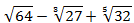
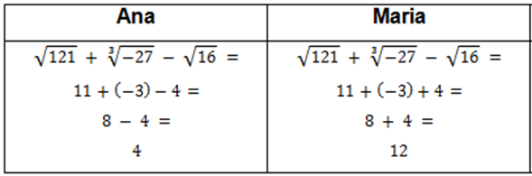
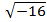
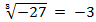
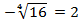
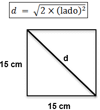
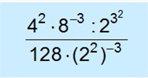

# Questao 1

Questão - 1
40. Analise a expressão envolvendo radiciação dada a seguir:

Calcule o valor da expressão considerando que cada termo é elevado ao quadrado antes de realizar as operações de soma e subtração. Seu resultado é

Opções de resposta:

A) 49

B) 169

C) 81

D) 169

# Questao 2

Questão - 2
37- Leia com atenção os casos apresentados, prestando atenção nas resoluções das expressões matemáticas. Ana e Maria resolveram uma expressão matemática.

Sobre as resoluções das expressões, é correto afirmar que, se Ana tivesse considerado a expressão com todos os termos elevados ao quadrado, enquanto Maria manteve a expressão original, então

Opções de resposta:

A) apenas a Ana acertou.

B) apenas a Maria acertou.

C) as duas acertaram.

D) as duas erraram.

# Questao 3

Questão - 3
31. Qual o valor da raíz quadrada de 9 multiplicado pelo cubo de 2?

Opções de resposta:

A) 24

B) 0

C) 81

D) 9

# Questao 4

Questão - 4
Na figura, observam-se alguns polígonos.

©Edição de arte. 2019. Digital.
Além de identificar os polígonos, calcule a soma dos ângulos internos do pentágono e do hexágono. Os nomes dos polígonos são, respectivamente,

Opções de resposta:

A) triângulo, quadrilátero, pentágono, hexágono e heptágono.

B) triângulo, quadrilátero, pentágono, hexágono e octógono.

C) octógono, triângulo, pentágono, quadrilátero e hexágono.

D) octógono, triângulo, hexágono, quadrilátero e pentágono.

# Questao 5

Questão - 5
38. A tabela mostra a venda de um jornaleiro durante uma semana.

['Dias', 'Segunda', 'Terça', 'Quarta', 'Quinta', 'Sexta', 'Sábado', 'Domingo', 'Jornais vendidos', '67', '43', '52', '48', '49', '82', '93']

Calcule a média de jornais vendidos durante a semana e determine o desvio padrão das vendas.

Opções de resposta:

A) Média: 62, Desvio Padrão: 15

B) Média: 58, Desvio Padrão: 20

C) Média: 78, Desvio Padrão: 25

D) Média: 45, Desvio Padrão: 10

# Questao 6

Questão - 6
37- Analise as raízes e suas respostas, apresentadas nos seguintes itens:

I. 

 não possui solução para os números reais.

II. 

III. 

Se considerarmos as raízes no conjunto dos números complexos, podemos afirmar que

Opções de resposta:

A) apenas I está correto.

B) apenas II está correto.

C) apenas III está correto.

D) I e II estão corretos

# Questao 7

Questão - 7
36- Observe as informações dadas a seguir, para responder à pergunta. A medida da diagonal de um quadrado pode ser calculada pela expressão 

 Se o lado do quadrado fosse aumentado em 50%, qual seria o novo valor aproximado da diagonal?

Opções de resposta:

A) 225

B) 30

C) 21

D) 5,5

# Questao 8

Um posto de saúde registrou a quantidade de vacinas aplicadas contra febre amarela nos últimos cinco meses: ['Mês', 'Quantidade', '1° mês', '21', '2° mês', '22', '3° mês', '25', '4° mês', '31', '5° mês', '21'] No início do primeiro mês, esse posto de saúde tinha 228 vacinas contra febre amarela em estoque. A política de reposição do estoque prevê a aquisição de novas vacinas, no início do sexto mês, de tal forma que a quantidade inicial em estoque para os próximos meses seja igual a 12 vezes a média das quantidades mensais dessas vacinas aplicadas nos últimos cinco meses. Considerando que a demanda mensal aumente em 10% a partir do sexto mês, quantas vacinas o posto deve adquirir para atender a nova demanda?

Opções de resposta:

A) 156

B) 180

C) 192

D) 264

# Questao 9

Questão - 9
39. A tabela mostra a distribuição das idades dos alunos de uma classe.

['Número de Alunos', 'Idade (em anos)', '12', '10', '12', '11', '8', '12', '1', '15']

Calcule a média das idades dos alunos e determine a moda e a mediana das idades.

Opções de resposta:

A) Média: 10, Moda: 12, Mediana: 11

B) Média: 11, Moda: 12, Mediana: 12

C) Média: 12, Moda: 12, Mediana: 13

D) Média: 13, Moda: 12, Mediana: 14

# Questao 10

Questão - 10
32- Alguns alunos do 8.º ano estão participando de uma competição on-line de matemática.

Eles chegaram à última questão da competição e para vencer precisariam resolvê-la corretamente. A questão pede para simplificar em uma única potência a seguinte expressão:

Além disso, determine o valor numérico da expressão simplificada.

Opções de resposta:

A) 2-15, Valor: 0.00003

B) 2-13, Valor: 0.0001

C) 2-12, Valor: 0.00024

D) 1-14, Valor: 0.00006

