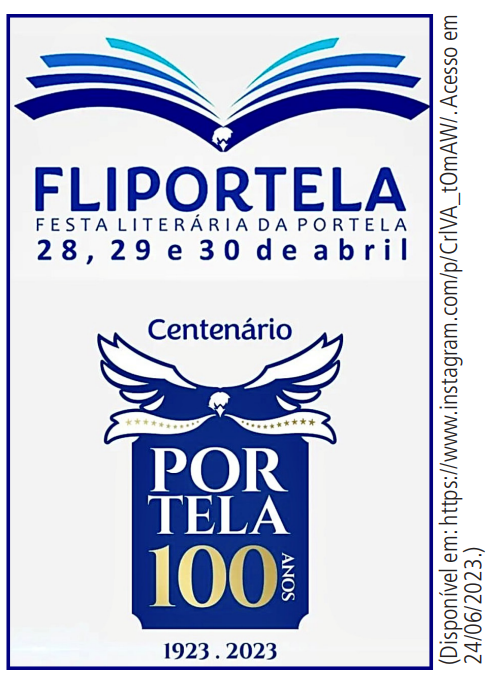

# Questao 1

Questão - 1

ANÉSIA #535. Will Tirando, 23 nov. 2020. Disponível em: https://www.willtirando.com.br. Acesso em: 14 ago. 2021.

O humor da tirinha de Dona Anésia vem do contraste entre o que se espera e o que é dito. A personagem Anésia é pessimista, mas a situação sugere otimismo.

**Dicas de apoio**
- Observe o contexto da tirinha e a relação entre as falas dos personagens.
- Considere o uso de linguagem figurada, como o sentido figurado e conotativo, para entender o humor.
- Pense sobre a expectativa criada pela situação e como ela é subvertida para gerar humor.

**Passo a Passo**
1. Observe a tirinha com atenção e identifique os elementos principais: o apresentador de notícias e a personagem Anésia.
2. Reflita sobre a mensagem que o apresentador está transmitindo na tirinha.
3. Considere o contexto em que a personagem Anésia faz seu comentário final.
4. Pense sobre o contraste entre o que é dito pelo apresentador e a reação da personagem.
5. Relacione o humor da tirinha com o uso de linguagem figurada ou conotativa.
6. Escolha a opção que melhor representa o efeito de humor baseado nos elementos analisados.

Opções de resposta:

A) A personagem Anésia é muito otimista.

B) A expressão 'má notícia' é usada de forma diferente, mostrando pessimismo.

C) A frase 'as pessoas estão cada vez menos otimistas' tem um sentido figurado.

D) Os programas só mostram notícias ruins de forma clara.

E) A personagem Anésia é implicitamente pessimista.

# Questao 2

Questão - 2

NEVOEIRO

Nem rei nem lei, nem paz nem guerra,
Define com perfil e ser
Este fulgor baço da terra
Que é Portugal a entristecer-
Brilho sem luz e sem arder,
Como o que o fogo-fátuo encerra.

Ninguém sabe que coisa quer.
Ninguém conhece que alma tem,
Nem o que é mal nem o que é bem.
(Que ânsia distante perto chora?)
Tudo é incerto e derradeiro.
Tudo é disperso, nada é inteiro.
Ó Portugal, hoje és nevoeiro…

É A HORA!
PESSOA, Fernando. Mensagem. São Paulo: Ateliê Editorial, 2015.

O poema usa várias figuras de linguagem. Podemos dizer que

**Dicas de apoio**
- Identifique o esquema de rimas e a métrica do poema para entender a estrutura.
- Observe a linguagem figurada, como metáforas e personificações, que contribuem para o tom do poema.
- Considere o contexto histórico e cultural de Portugal para interpretar o sentimento de nevoeiro e incerteza.

**Passo a Passo**
1. Leia o poema atentamente, observando a estrutura e o esquema de rimas.
2. Identifique as figuras de linguagem utilizadas, como metáforas e personificações.
3. Reflita sobre o tom e a mensagem geral do poema.
4. Considere como a forma do poema contribui para seu significado.
5. Escolha a opção que melhor descreve os recursos expressivos identificados.

Opções de resposta:

A) o esquema de rimas é o mesmo nas duas primeiras estrofes.

B) a repetição de palavras deixa o poema mais pobre.

C) o ritmo é feito pela alternância de sílabas fortes e fracas.

D) Portugal é exaltado por meio da personificação.

E) as estrofes regulares mostram preocupação com a forma.

# Questao 3

Questão - 3
A petição on-line de um paulista mudou a definição de 'casamento' no dicionário Michaelis. Antes, era 'união entre homem e mulher'. Agora, é 'união entre pessoas'. O diretor do site da petição disse que isso mostra a força da mobilização. Em dois dias, uma definição antiga foi alterada. A plataforma serve para várias causas importantes.

SENRA, R. Disponível em: . Acesso em: 29 out. 2015.

A mudança no dicionário foi causada pela

**Dicas de apoio**
- Reflita sobre o impacto social e cultural das definições de palavras em dicionários.
- Considere o papel das petições online como ferramentas de mobilização social.
- Pense sobre como a linguagem pode evoluir para refletir mudanças sociais e culturais.

**Passo a Passo**
1. Leia o texto com atenção, identificando a mudança na definição do termo "casamento".
2. Reflita sobre o papel da petição on-line na alteração do verbete.
3. Considere a importância da mobilização social na mudança de definições tradicionais.
4. Pense sobre como a rapidez da mudança reflete a eficácia das plataformas digitais.
5. Escolha a opção que melhor representa o motivo da mudança segundo o texto.

Opções de resposta:

A) inclusão de novas informações no verbete.

B) importância social do casamento.

C) uso público da petição por cidadãos.

D) rápida divulgação digital do verbete.

E) promoção de plataformas de petição.

# Questao 4

Questão - 4
Maio foi colorido de amarelo, e o foi porque mundialmente amarelo é a cor convencionada para as advertências. No trânsito, essas advertências têm sido fatais. A estimativa, caso nada seja feito, é a de que se atinjam assustadoras 2,4 milhões de mortes no trânsito em 2030 em todo o mundo.
A pressa constante, o sentimento de invencibilidade, a certeza de invulnerabilidade, a necessidade de poder, a falta de civilidade, a certeza de impunidade, a ausência de solidariedade, a inexistência de compaixão e o desrespeito por si próprio são circunstâncias reais que, não raro, concorrem para o comportamento violento no trânsito.
O Maio Amarelo, que preconiza a atenção pela vida, é uma das iniciativas nesse sentido. E é precisamente a atenção pela vida que está esquecida. Essa atenção, por certo, requer menos pressa, mais civilidade, limites assegurados, consciência de vulnerabilidade, solidariedade, compaixão e respeito por si e pelo outro. Reafirmar e praticar esses princípios e valores talvez seja um caminho mais seguro e menos violento, que garanta a vida e não celebre a morte.

Disponível em: . Acesso em: 11 dez. 2018 (adaptado).

O texto quer

**Dicas de apoio**
- Identifique as causas e consequências apresentadas no texto sobre a violência no trânsito.
- Reflita sobre o significado das cores de advertência e sua aplicação no contexto do trânsito.
- Considere as atitudes e valores que são promovidos como soluções para o problema apresentado.

**Passo a Passo**
1. Leia o texto com atenção, destacando as razões para a escolha da cor amarela.
2. Identifique os problemas de comportamento no trânsito mencionados.
3. Reflita sobre a mensagem central do Maio Amarelo.
4. Considere como a campanha busca sensibilizar o público para a segurança no trânsito.
5. Escolha a opção que melhor representa o objetivo do texto.

Opções de resposta:

A) listar as causas da violência no trânsito.

B) explicar a campanha de alerta no mundo.

C) mostrar dados alarmantes sobre acidentes.

D) conscientizar sobre a importância de dirigir com responsabilidade.

E) limitar os problemas do trânsito a questões emocionais.

# Questao 5

Questão - 5
No início era a palavra. Essa ideia está na Bíblia e em outras religiões. A linguagem é essencial para os humanos. Imagine um mundo sem palavras ou onde ninguém entende o outro. A linguagem tem sido usada para manter privilégios. Quem entende o jargão de advogados ou médicos? Muitos não entendem a linguagem dos poderosos.

BRUM, E. Disponível em: . Acesso em: 5 nov. 2021.

O texto mostra que muitos não entendem a linguagem do poder por meio de

**Dicas de apoio**
- Reflita sobre o papel da linguagem como ferramenta de poder e exclusão.
- Considere a importância da comunicação clara e acessível para todos os membros da sociedade.
- Pense sobre as consequências sociais de não se ter uma linguagem comum para o entendimento mútuo.

**Passo a Passo**
1. Leia o texto com atenção, focando na relação entre linguagem e poder.
2. Identifique exemplos de como a linguagem é usada para manter privilégios.
3. Reflita sobre as consequências do esfacelamento da linguagem.
4. Considere a crítica feita aos usos especializados da linguagem.
5. Escolha a opção que melhor representa a estratégia de convencimento usada no texto.

Opções de resposta:

A) mostrar a origem religiosa da linguagem.

B) questionar o futuro da linguagem.

C) descrever a relação entre sociedade e linguagem.

D) mostrar o que acontece quando a linguagem se perde.

E) criticar o uso especializado da linguagem.

# Questao 6

Questão - 6
“São tantas formas de matar um preto
Que para alguns sua morte é justificada
Devia tá fazendo coisa errada
Se não era bandido, um dia ia ser
Por ser PRETO sua morte é defendida
O PRETO sempre merece morrer”.
A estrofe é do poeta Baticum Proletário, que trabalha em Fortaleza, ajudando jovens negros a enfrentar o racismo. Ele usa a arte para engajar a juventude em projetos de fortalecimento. O Atlas da violência de 2019 mostra que 77% das vítimas de homicídios são negras. Um negro tem 2,7 vezes mais chance de ser morto que um branco.

MENDONÇA, F. Disponível em: . Acesso em: 22 nov. 2021 (adaptado).

A citação e os dados no texto servem para

**Dicas de apoio**
- Reflita sobre o impacto dos dados estatísticos na compreensão da gravidade do problema apresentado.
- Considere o papel da arte e da cultura como formas de resistência e conscientização social.
- Pense sobre como a linguagem poética pode ser utilizada para expressar e denunciar injustiças sociais.

**Passo a Passo**
1. Leia o texto com atenção, destacando a citação e os dados estatísticos apresentados.
2. Reflita sobre como esses elementos reforçam a mensagem do texto.
3. Considere o impacto dos dados na compreensão do problema social discutido.
4. Pense sobre o papel da arte como forma de resistência e denúncia.
5. Escolha a opção que melhor representa o objetivo do uso de citação e dados no texto.

Opções de resposta:

A) mostrar a importância da poesia em denunciar a morte de negros.

B) destacar o aumento do preconceito na literatura.

C) mostrar mais expressões artísticas discutindo problemas sociais.

D) reforçar que negros são vítimas da violência.

E) mostrar o aumento da participação jovem em movimentos culturais.

# Questao 7

Questão - 7
Sobre os contos “Nós matamos o Cão Tinhoso!”, “Dina”, “Papá, cobra e eu” e “Nhinguitimo”, do livro Nós matamos o Cão Tinhoso!, podemos dizer que

**Dicas de apoio**
- Identifique os narradores e protagonistas dos contos mencionados.
- Reflita sobre os temas centrais dos contos e como eles se relacionam com a sociedade moçambicana.
- Considere o papel da opressão social e as reações dos personagens dentro das narrativas.

**Passo a Passo**
1. Leia os contos mencionados, focando nos narradores e protagonistas.
2. Identifique o ponto de vista narrativo utilizado em cada conto.
3. Reflita sobre as condições sociais dos protagonistas.
4. Considere a relação entre os protagonistas e seus opressores.
5. Escolha a opção que melhor resume as características dos contos.

Opções de resposta:

A) Os narradores e protagonistas são crianças.

B) São contados em primeira pessoa, por quem vive a história.

C) Os protagonistas são oprimidos e não reagem contra os opressores.

D) São fábulas com animais como protagonistas.

E) O cenário é de grandes cidades em Moçambique.

# Questao 8

Questão - 8
Leia o texto a seguir:

Uma vida inteira pela frente.
O tiro veio por trás.

Cíntia Moscovich, Os cem menores contos brasileiros do século (organização: Marcelino Freire).

Mesmo sendo curto, o texto é uma narrativa porque tem

**Dicas de apoio**
- Reflita sobre os elementos essenciais de uma narrativa, como personagens, ações e desfechos.
- Considere como a brevidade do texto ainda permite a construção de uma história completa.
- Pense sobre a sequência de ações e como elas criam uma narrativa, mesmo em textos curtos.

**Passo a Passo**
1. Leia o texto com atenção, observando a estrutura narrativa.
2. Identifique os elementos de ação presentes nas duas linhas.
3. Reflita sobre como essas ações criam uma sequência narrativa.
4. Considere a presença de um conflito implícito no texto.
5. Escolha a opção que melhor explica a caracterização do texto como narrativa.

Opções de resposta:

A) uso de adjetivos para tempos.

B) diálogo entre narradores.

C) referência a lugares.

D) descrição de personagens.

E) sequência de ações.

# Questao 9

Questão - 9
O anúncio (Texto 1) foi postado nas redes sociais da Portela, escola de samba do Rio, para divulgar uma festa literária. A escola tem a águia como símbolo (Texto 2) e completou 100 anos em 2023.

Texto 1

Texto 2

Com base na imagem do texto 2, podemos dizer que o texto 1 faz uma

**Dicas de apoio**
- Observe a relação entre os elementos visuais e textuais nos textos apresentados.
- Reflita sobre como os símbolos e temas são utilizados para criar uma mensagem coesa.
- Considere o contexto cultural e histórico da Portela e sua representação na festa literária.

**Passo a Passo**
1. Observe as imagens dos textos 1 e 2, identificando os elementos visuais principais.
2. Reflita sobre a relação entre o símbolo da águia e a festa literária.
3. Considere como o símbolo da Portela é ressignificado no contexto da festa.
4. Pense sobre a integração entre a tradição da escola de samba e a expressão literária.
5. Escolha a opção que melhor representa a relação entre os textos e as imagens.

Opções de resposta:

A) fusão entre o símbolo da escola e a expressão literária, visível nas asas da águia.

B) relação entre a festa literária e o símbolo da escola, que representa a literatura.

C) associação das asas da águia com o nome da festa literária, que inclui o nome da escola.

D) nova interpretação do símbolo da Portela, destacando o centenário como tema da festa.

# Questao 10

Questão - 10
“Mas quantas vezes a insônia é um dom. De repente acordar no meio da noite e ter essa coisa rara: solidão. Quase nenhum ruído. Só o das ondas do mar batendo na praia. E tomo café com gosto, toda sozinha no mundo. Ninguém me interrompe o nada. É um nada a um tempo vazio e rico. E o telefone mudo, sem aquele toque súbito que sobressalta. Depois vai amanhecendo. As nuvens se clareando sob um sol às vezes pálido como uma lua, às vezes de fogo puro. Vou ao terraço e sou talvez a primeira do dia a ver a espuma branca do mar. O mar é meu, o sol é meu, a terra é minha. E sinto-me feliz por nada, por tudo. Até que, como o sol subindo, a casa vai acordando e há o reencontro com meus filhos sonolentos.”

Clarice Lispector. “Insônia infeliz e feliz”. In: A descoberta do mundo. Rio de Janeiro: Rocco, 1999.

O trecho é uma crônica porque

**Dicas de apoio**
- Reflita sobre as características de uma crônica, como a brevidade e o foco em eventos cotidianos.
- Considere o tom pessoal e introspectivo do texto, típico das crônicas de Clarice Lispector.
- Pense sobre como a narrativa captura um momento específico e suas reflexões associadas.

**Passo a Passo**
1. Leia o trecho com atenção, observando a linguagem e o estilo.
2. Identifique elementos do cotidiano presentes na narrativa.
3. Reflita sobre a estrutura e a simplicidade do texto.
4. Considere como o texto captura um momento específico do dia a dia.
5. Escolha a opção que melhor caracteriza o texto como uma crônica.

Opções de resposta:

A) conta uma história paralela a uma principal.

B) tem um conflito que se resolve rapidamente.

C) é simples e tem um ensinamento.

D) é breve e fala de um evento cotidiano.

E) faz uma crítica indireta a alguém ou algo.

