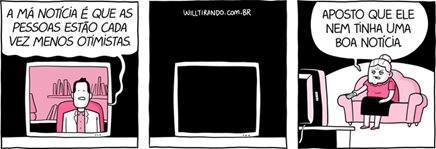
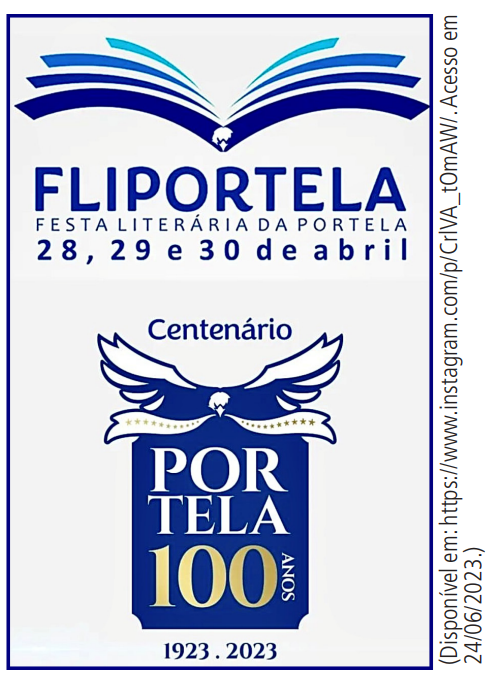
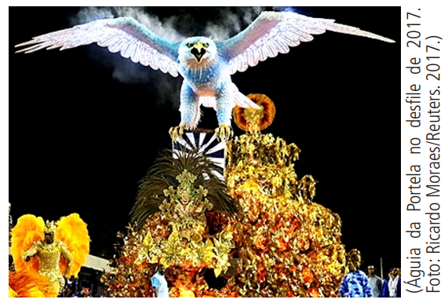

# Questao 1

Questão - 1

ANÉSIA #535. Will Tirando, 23 nov. 2020. Disponível em: https://www.willtirando.com.br. Acesso em: 14 ago. 2021.

O humor da tirinha de Dona Anésia vem do contraste entre a expectativa de uma boa notícia e a realidade pessimista apresentada.

**Dicas de apoio**
- Observe o contexto da tirinha e a relação entre o que é dito pelo apresentador de notícias e a reação da personagem Anésia.
- Considere o uso de linguagem figurada e como ela pode criar um efeito humorístico.
- Pense sobre o contraste entre o que é esperado e o que é apresentado na tirinha.

**Passo a Passo**
1. Observe a tirinha apresentada na imagem e identifique os elementos principais: o apresentador de notícias e a personagem Anésia.
2. Reflita sobre o que cada personagem está dizendo e como isso pode gerar humor.
3. Considere o uso de linguagem figurada ou conotativa nas falas dos personagens.
4. Pense sobre o contexto social ou psicológico que pode estar implícito na tirinha.
5. Analise as opções de resposta e relacione-as com a interpretação que fez da tirinha.

Opções de resposta:

A) porque Anésia é muito otimista.

B) porque a frase 'má notícia' é usada de forma irônica para mostrar pessimismo.

C) porque a frase 'as pessoas estão cada vez menos otimistas' é usada de forma figurada.

D) porque os programas só mostram notícias ruins.

E) porque Anésia é uma pessoa pessimista.

# Questao 2

Questão - 2

NEVOEIRO

Nem rei nem lei, nem paz nem guerra,
Define com perfil e ser
Este fulgor baço da terra
Que é Portugal a entristecer-
Brilho sem luz e sem arder,
Como o que o fogo-fátuo encerra.

Ninguém sabe que coisa quer.
Ninguém conhece que alma tem,
Nem o que é mal nem o que é bem.
(Que ânsia distante perto chora?)
Tudo é incerto e derradeiro.
Tudo é disperso, nada é inteiro.
Ó Portugal, hoje és nevoeiro…

É A HORA!
PESSOA, Fernando. Mensagem. São Paulo: Ateliê Editorial, 2015.

O poema usa recursos expressivos para mostrar a incerteza e a tristeza de Portugal.

**Dicas de apoio**
- Analise o esquema de rimas nas estrofes para identificar padrões.
- Reflita sobre a personificação e como ela pode ser usada para exaltar um país.
- Considere a estrutura das estrofes e o que isso pode indicar sobre a intenção do autor.

**Passo a Passo**
1. Leia atentamente o poema e identifique as figuras de linguagem utilizadas.
2. Observe o esquema de rimas e a métrica dos versos.
3. Reflita sobre o tom e a atmosfera que o poema transmite.
4. Considere a personificação e outros recursos expressivos que possam exaltar Portugal.
5. Compare suas observações com as opções de resposta para encontrar a mais adequada.

Opções de resposta:

A) As duas primeiras estrofes têm o mesmo esquema de rimas.

B) Repetir expressões nos versos torna o poema menos rico.

C) O ritmo é criado pela alternância de sílabas fortes e fracas.

D) Portugal é exaltado através da personificação.

E) As estrofes regulares mostram preocupação com a estrutura.

# Questao 3

Questão - 3
A petição on-line de um cidadão paulista conseguiu mudar a definição de 'casamento' no dicionário Michaelis. Antes, era 'união entre homem e mulher'. Agora, é 'união entre pessoas'. Isso mostra a força da mobilização pública.

**Dicas de apoio**
- Reflita sobre o papel das petições on-line e como elas podem influenciar mudanças sociais.
- Considere a importância da linguagem inclusiva e como ela reflete transformações culturais.
- Pense sobre a rapidez com que mudanças podem ocorrer em uma era digital.

**Passo a Passo**
1. Leia o texto e identifique o problema inicial apresentado.
2. Observe como a petição online foi utilizada para promover a mudança.
3. Reflita sobre a importância da mobilização social na alteração de definições.
4. Considere o papel das plataformas digitais na disseminação de ideias e mudanças sociais.
5. Relacione suas observações com as opções de resposta para escolher a mais adequada.

Opções de resposta:

A) pela inclusão de novas informações no verbete.

B) pela importância social do casamento.

C) pela participação pública na petição.

D) pela rápida divulgação digital.

E) pela promoção de plataformas de petição.

# Questao 4

Questão - 4
Maio é amarelo porque essa cor é usada para alertas. No trânsito, esses alertas são importantes para evitar mortes. Se nada mudar, haverá 2,4 milhões de mortes no trânsito até 2030. O Maio Amarelo quer lembrar a importância de dirigir com cuidado e respeito.

**Dicas de apoio**
- Reflita sobre as campanhas de conscientização e seu papel na mudança de comportamentos sociais.
- Considere como a cor amarela é usada como símbolo de advertência e atenção.
- Pense sobre a importância de valores como civilidade e respeito no contexto do trânsito.

**Passo a Passo**
1. Leia o texto e identifique os principais problemas relacionados ao trânsito mencionados.
2. Reflita sobre o significado da cor amarela e sua relação com advertências.
3. Considere a importância da campanha Maio Amarelo e seus objetivos.
4. Pense sobre como a mudança de comportamento pode impactar a segurança no trânsito.
5. Compare suas observações com as opções de resposta para escolher a mais adequada.

Opções de resposta:

A) mostrar as causas da violência no trânsito.

B) explicar a campanha de alerta no mundo.

C) mostrar números alarmantes de acidentes.

D) conscientizar sobre a importância de dirigir com responsabilidade.

E) limitar os problemas do trânsito a questões emocionais.

# Questao 5

Questão - 5
No princípio era o verbo. A frase que abre o primeiro capítulo do Evangelho de João e remete à criação do mundo, assim como também faz o Gênesis, é a mais famosa da Bíblia. A ideia de que o mundo é criado pela palavra, porém, é tão estruturante que está presente em outras religiões, para muito além das fundadas no cristianismo. Como humanos, a linguagem é o mundo que habitamos. Basta tentar imaginar um mundo em que não podemos usar palavras para dizer de nós e dos outros para compreender o que isso significa. Ou um mundo em que aquilo que você diz não é entendido pelo outro, e o que o outro diz não é entendido por você.
O que acontece então quando a palavra é destruída e, com ela, a linguagem?
Durante séculos, em diferentes sociedades e línguas, é importante lembrar, a linguagem serviu — e ainda serve — para manter privilégios de grupos de poder e deixar todos os outros de fora. Quem entende linguagem de advogados, juízes e promotores, linguagem de médicos, linguagem de burocratas, linguagem de cientistas? A maior parte da população foi submetida à violência de propositalmente ser impedida de compreender a linguagem daqueles que determinam seus destinos.
Se o princípio é o verbo, o fim pode ser o silenciamento. Mesmo que ele seja cheio de gritos entre aqueles que já não têm linguagem comum para compreender uns aos outros.

BRUM, E. Disponível em: . Acesso em: 5 nov. 2021.

Nesse texto, a estratégia usada para convencer o leitor de que uma grande parcela da população não compreende a linguagem daqueles que detêm o poder foi

**Dicas de apoio**
- Reflita sobre o papel da linguagem na construção de poder e exclusão social.
- Considere como a linguagem pode ser usada como uma ferramenta de controle ou de emancipação.
- Pense sobre as consequências de não se ter uma linguagem comum para comunicação.

**Passo a Passo**
1. Leia o texto e identifique a ideia central sobre a linguagem e o poder.
2. Reflita sobre como a linguagem pode ser usada para manter privilégios.
3. Considere o impacto do silenciamento e da falta de compreensão mútua.
4. Pense sobre exemplos de linguagens especializadas que excluem a maioria.
5. Relacione suas observações com as opções de resposta para escolher a mais adequada.

Opções de resposta:

A) revelar a origem religiosa da linguagem.

B) questionar o temor sobre o futuro da linguagem.

C) descrever a relação entre sociedade e linguagem.

D) apresentar as consequências do esfacelamento da linguagem.

E) criticar o obstáculo promovido pelos usos especializados da linguagem.

# Questao 6

Questão - 6
“São tantas formas de matar um preto
Que para alguns sua morte é justificada
Devia tá fazendo coisa errada
Se não era bandido, um dia ia ser
Por ser PRETO sua morte é defendida
O PRETO sempre merece morrer”.
A estrofe acima é do poeta Baticum Proletário, que usa a arte para preparar jovens negros para enfrentar o racismo. Ele promove eventos que discutem a violência, como batalhas de rimas. O Atlas da violência mostra que negros são 77% das vítimas de homicídios. Um negro tem 2,7 vezes mais chance de ser morto do que um branco.

**Dicas de apoio**
- Reflita sobre como a arte pode ser uma forma de resistência e denúncia social.
- Considere o impacto dos dados estatísticos na conscientização sobre a violência racial.
- Pense sobre a importância de movimentos sociais na luta contra o racismo estrutural.

**Passo a Passo**
1. Leia o texto e identifique as principais estatísticas apresentadas.
2. Reflita sobre o impacto dessas estatísticas na percepção do racismo estrutural.
3. Considere o papel da arte e da poesia na conscientização social.
4. Pense sobre como os dados reforçam a necessidade de resistência e mudança.
5. Compare suas observações com as opções de resposta para escolher a mais adequada.

Opções de resposta:

A) mostrar como a poesia denuncia a morte de negros.

B) mostrar como o preconceito cresce na literatura.

C) mostrar como a arte discute problemas sociais.

D) mostrar que negros são mais vítimas de violência.

E) mostrar o aumento da resistência cultural dos jovens.

# Questao 7

Questão - 7
Sobre os contos “Nós matamos o Cão Tinhoso!”, “Dina”, “Papá, cobra e eu” e “Nhinguitimo”, pode-se dizer que

**Dicas de apoio**
- Reflita sobre a perspectiva dos narradores e como isso influencia a narrativa.
- Considere o contexto social e histórico em que os contos foram escritos.
- Pense sobre o papel dos protagonistas e suas relações com os opressores.

**Passo a Passo**
1. Leia atentamente os contos mencionados, se possível, ou pesquise sobre eles.
2. Identifique os narradores e protagonistas de cada conto.
3. Reflita sobre a situação social e as reações dos protagonistas.
4. Considere o gênero literário e o estilo narrativo dos contos.
5. Compare suas observações com as opções de resposta para escolher a mais adequada.

Opções de resposta:

A) os narradores e protagonistas são crianças.

B) são narrados em primeira pessoa por protagonistas.

C) os protagonistas são oprimidos e não reagem aos opressores.

D) são fábulas com animais como protagonistas.

E) o cenário é de grandes cidades moçambicanas.

# Questao 8

Questão - 8
Leia o texto a seguir:

Uma vida inteira pela frente.
O tiro veio por trás.

Cíntia Moscovich, Os cem menores contos brasileiros do século (organização: Marcelino Freire).

Mesmo sendo curto, o texto é uma narrativa porque apresenta

**Dicas de apoio**
- Reflita sobre os elementos essenciais de uma narrativa, como ação, personagens e tempo.
- Considere como a brevidade pode intensificar o impacto de uma história.
- Pense sobre a sequência de eventos e como eles são apresentados.

**Passo a Passo**
1. Leia o texto e identifique os elementos narrativos presentes.
2. Reflita sobre a sequência de ações e como elas criam uma narrativa.
3. Considere o impacto emocional e a mensagem transmitida pelo texto.
4. Pense sobre a estrutura mínima necessária para caracterizar uma narrativa.
5. Compare suas observações com as opções de resposta para escolher a mais adequada.

Opções de resposta:

A) uso de adjetivos para tempos.

B) diálogo entre narradores.

C) referência a lugares.

D) descrição de personagens.

E) sequência de ações.

# Questao 9

Questão - 9
O anúncio (Texto 1) foi postado nas redes sociais da Portela para divulgar uma festa literária. A escola, que tem a águia como símbolo, completou 100 anos em 2023.

Texto 1

Texto 2

Com base na imagem do texto 2, o texto 1 faz uma

**Dicas de apoio**
- Reflita sobre a simbologia da águia para a escola de samba Portela e como ela é utilizada nos materiais promocionais.
- Considere a relação entre a arte visual e a mensagem literária no contexto do anúncio.
- Pense sobre a importância do centenário da escola e como isso é destacado no material.

**Passo a Passo**
1. Observe atentamente as imagens nos textos 1 e 2.
2. Identifique os símbolos e elementos principais em cada imagem.
3. Reflita sobre a relação entre a festa literária e o símbolo da escola de samba.
4. Considere como a imagem do símbolo pode ser ressignificada no contexto da festa.
5. Compare suas observações com as opções de resposta para escolher a mais adequada.

Opções de resposta:

A) fusão entre o símbolo da escola e a literatura, visível nas asas da águia.

B) relação entre a festa literária e o símbolo da escola, que representa a literatura.

C) associação das asas da águia com o nome da festa literária, 'FLIPORTELA'.

D) nova interpretação do símbolo da Portela, ligando-o à literatura para celebrar o centenário.

# Questao 10

Questão - 10
“Mas quantas vezes a insônia é um dom. De repente acordar no meio da noite e ter essa coisa rara: solidão. Quase nenhum ruído. Só o das ondas do mar batendo na praia. E tomo café com gosto, toda sozinha no mundo. Ninguém me interrompe o nada. É um nada a um tempo vazio e rico. E o telefone mudo, sem aquele toque súbito que sobressalta. Depois vai amanhecendo. As nuvens se clareando sob um sol às vezes pálido como uma lua, às vezes de fogo puro. Vou ao terraço e sou talvez a primeira do dia a ver a espuma branca do mar. O mar é meu, o sol é meu, a terra é minha. E sinto-me feliz por nada, por tudo. Até que, como o sol subindo, a casa vai acordando e há o reencontro com meus filhos sonolentos.”

Clarice Lispector. “Insônia infeliz e feliz”. In: A descoberta do mundo. Rio de Janeiro: Rocco, 1999.

O trecho é uma crônica porque

**Dicas de apoio**
- Reflita sobre as características de uma crônica, como a brevidade e o foco em eventos cotidianos.
- Considere o uso da primeira pessoa e como isso cria uma conexão íntima com o leitor.
- Pense sobre a estrutura narrativa e como ela se desenvolve ao longo do texto.

**Passo a Passo**
1. Leia o texto e identifique os elementos que caracterizam uma crônica.
2. Reflita sobre o tema cotidiano abordado e como ele é apresentado.
3. Considere a estrutura narrativa e o tom pessoal do texto.
4. Pense sobre a brevidade e a reflexão pessoal típica de uma crônica.
5. Compare suas observações com as opções de resposta para escolher a mais adequada.

Opções de resposta:

A) conta uma história paralela a uma principal.

B) tem um conflito que se resolve rapidamente.

C) tem estrutura simples e ensina algo.

D) é uma narrativa breve sobre um evento cotidiano.

E) faz uma crítica indireta a alguém ou algo.

