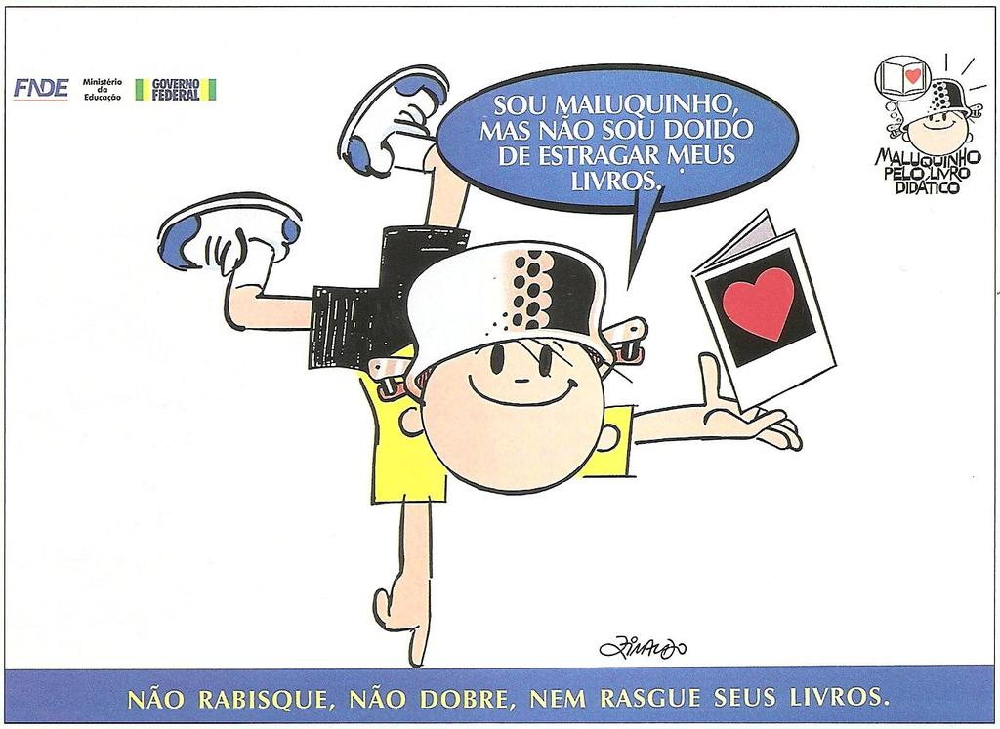

# Questao 1

Se uma pessoa quisesse ter informações sobre o filme “O casamento dos Trapalhões”, ela leria dois textos. Primeiro, para saber o enredo do filme, qual texto ela deve ler?

Segundo, para conhecer a opinião de outras pessoas sobre o filme, qual texto ela deve ler?

Agora, escolha a opção correta para saber qual texto ler para cada informação desejada.

Opções de resposta:

A) O texto B para saber o enredo e o texto A para conhecer a opinião de outras pessoas sobre o filme.

B) O texto A para saber o enredo e o texto B para conhecer a opinião de outras pessoas sobre o filme.

C) O texto A para saber o enredo e o texto B para conhecer as pessoas que assistiram ao filme.

D) O texto A para conhecer todos os profissionais que trabalharam no filme e o texto B para saber a opinião das pessoas que trabalharam no filme.

# Questao 2

As primeiras histórias em quadrinhos surgiram em jornais, em forma de tiras direcionadas aos adultos. A ideia agradou às crianças e, na década de 1930, começaram as publicações infantis. Numa história em quadrinhos, são utilizados muitos recursos. O recurso que representa os sons por meio de palavras é chamado de:

Escolha a opção correta.

Opções de resposta:

A) Enredo.

B) Personagem.

C) Balão.

D) Onomatopeias.

# Questao 3

Questão - 3

Observe a propaganda:

No trecho: “Sou Maluquinho, **mas** não sou louco de estragar meus livros!”. A palavra destacada estabelece uma relação de:

Escolha a opção correta.

Opções de resposta:

A) Conclusão.

B) Explicação.

C) Contradição.

D) Alternância.

# Questao 4

Leia a manchete da notícia, atentando-se para a conjunção sublinhada.

Capivara invade casa em Cuiabá **e** assusta moradora que a confundiu com um cachorro

[...] CAPIVARA invade casa em Cuiabá e assusta a moradora que a confundiu com um cachorro. Disponível em: . Acesso em: 19 jan. 2022. (grifo nosso)

A conjunção sublinhada no trecho indica o sentido de:

Escolha a opção correta.

Opções de resposta:

A) Causa.

B) Oposição.

C) Condição.

D) Adição.

# Questao 5

Leia o trecho abaixo observando as palavras destacadas.

[...] O Brasil, por conter uma grande dimensão territorial **e** uma população numerosa **e** miscigenada, com grande quantidade de descendentes de europeus, africanos, asiáticos **e** índios, apresenta uma vasta diversidade cultural no seu povo.[...]

As palavras destacadas são de qual classe gramatical?

Escolha a opção correta.

Opções de resposta:

A) Verbos.

B) Substantivos.

C) Conjunções.

D) Adjetivos.

# Questao 6

Questão - 6

Leia o texto abaixo:

**Cuidado com a dengue**

Os casos de dengue estão aumentando por todo o país e precisamos combater esse mal. É claro que, para isso, precisamos acabar com o mosquito AEDES AEGYPTI, transmissor da doença.

Almanaque do Chico Bento, nº 73 – Globo – 2003 – p. 35.

No trecho: “Os casos de dengue estão aumentando por todo o país e precisamos combater esse **mal**”, a palavra em destaque refere-se a quê?

Escolha a opção correta.

Opções de resposta:

A) À dengue.

B) Ao país.

C) A nós.

D) Ao mosquito.

# Questao 7

Leia a reportagem abaixo e responda a questão:

**Diretor de musicais critica ‘espetaculozinhos oportunistas’**

O teatro infantil não é dividido em megaproduções com personagens de TV e pequenas peças ligadas a clássicos de Literatura. Boa fatia é abocanhada por grandes musicais. Amanhã, estréia do show “Hi-5”, entra em cartaz “Mágico de Oz”.

É o mesmo lançado em 2003 e visto por 1,5 milhão. Billy Bond, diretor deste musical e de outros bem-sucedidos (“Les Misérables”, “A Bela e a Fera”) não quer se misturar a “espetaculozinhos oportunistas baseados em sucessos da TV”. “Não é um bonequinho da moda, é um clássico que passa mensagem e não só proporciona ao público um momentozinho”, dispara.

A psicóloga e colunista da Folha Rosely Sayão diz que, se os pais tiverem de optar entre um show da TV ou um clássico, o segundo é melhor. “Mas shows ligados à TV também podem ser bons porque a criança sabe o enredo e se liga na apresentação. O importante é criar o hábito de ir ao teatro” (LM)

Fonte: Folha de São Paulo. 4 de julho de 2008, E1

“É o **mesmo** lançado em 2003 e visto por 1,5 milhão”. A expressão destacada refere-se a qual espetáculo?

Escolha a opção correta.

Opções de resposta:

A) Show Hi-5.

B) Mágico de Oz.

C) Show de TV.

D) Teatro infantil.

# Questao 8

Questão - 8

Leia a fábula abaixo:

**O leão e o rato**

Um Leão dormia sossegado, quando foi despertado por um Rato, que passou correndo sobre seu rosto. Com um bote ágil ele o pegou, e estava pronto para matá-lo, quando o Rato suplicou:

- Ora, se o senhor me poupasse, tenho certeza que um dia poderia retribuir sua bondade.

Rindo por achar ridícula a ideia, assim mesmo, ele resolveu libertá-lo. Aconteceu que, pouco tempo depois, o Leão caiu numa armadilha colocada por caçadores. Preso ao chão, amarrado por fortes cordas, sequer podia mexer-se. O Rato, reconhecendo seu rugido, se aproximou e roeu as cordas até deixá-lo livre. Então disse:

- O senhor riu da ideia de que eu jamais seria capaz de ajudá-lo. Nunca esperava receber de mim qualquer favor em troca do seu! Mas agora sabe, que mesmo um pequeno Rato é capaz de retribuir um favor a um poderoso Leão.

**Moral:**

Os pequenos amigos podem se revelar os melhores e mais leais aliados. 

Fonte: https://sitededicas.uol.com.br/fabula3a.htm

Quando o rato dirige-se ao leão trata-o como “Senhor”. Essa forma de tratamento indica:

Escolha a opção correta.

Opções de resposta:

A) Inferioridade do leão.

B) Superioridade do rato.

C) Respeito do rato para com o leão.

D) Humildade do leão.

# Questao 9

Observe o texto abaixo:

**O reformador do mundo**

Américo Pisca- Pisca tinha o hábito de pôr defeito em todas as coisas. O mundo, para ele estava errado e a Natureza só fazia asneiras.

Asneiras, Américo?

Pois então? ... Aqui mesmo neste pomar, tens prova disso. Ali está uma jabuticabeira enorme sustentando frutas pequeninas, e, lá adiante uma colossal abóbora presa ao caule duma planta rasteira.

Não era lógico que fosse justamente ao contrário? Se as coisas tivessem de ser reorganizadas por mim, eu trocaria as bolas passando as jabuticabeiras para a aboboreira e as abóboras para as jabuticabeiras. Não acha que tenho razão?

Assim discorrendo, Américo provou que tudo estava errado e que só ele era capaz de dispor, com inteligência, o mundo. Mas o melhor concluiu é não pensar nisto e tirar uma soneca à sombra destas árvores, não achas?

E Pisca- Pisca, pisca- piscando que não acabava mais, estirou-se de papo acima à sombra da jabuticabeira.

Dormiu. Dormiu e sonhou. Sonhou com o mundo novo reformado inteirinho pelas suas mãos. Uma beleza! De repente, no melhor da festa, plaft! uma jabuticaba que cai e lhe esborracha o nariz.

Américo desperta de um pulo; medita sobre o caso e reconhece, afinal, que o mundo não é tão malfeito assim.

E segue para casa, refletindo:

Que espiga! Pois não é que se o mundo fosse arrumado por mim a primeira vítima teria sido eu?

Monteiro Lobato

No trecho “... Aqui mesmo neste pomar, tens prova **disso**.” A palavra em destaque refere-se a quê?

Escolha a opção correta.

Opções de resposta:

A) Ao mundo que para ele estava errado e a natureza só fazia asneira.

B) A Américo Pisca- Pisca.

C) Aqui mesmo neste pomar.

D) Ao hábito de pôr defeito em todas as coisas.

# Questao 10

Leia o texto abaixo:

**O Sapo e o Escorpião**

Certa vez, um escorpião aproximou-se de um sapo que estava na beira de um rio. O escorpião vinha fazer um pedido:

“Sapinho, você poderia me carregar até a outra margem deste rio tão largo?”

O sapo respondeu: “Só se eu fosse tolo! Você vai me picar, eu vou ficar paralisado e vou afundar.”

Disse o escorpião: “Isso é ridículo! Se eu o picasse, ambos afundaríamos.”

Confiando na lógica do escorpião, o sapo concordou e levou o escorpião nas costas, enquanto nadava para atravessar o rio. No meio do rio, o escorpião cravou seu ferrão no sapo. Atingido pelo veneno, e já começando a afundar, o sapo voltou-se para o escorpião e perguntou:

“Por quê? Por quê?”

E o escorpião respondeu: “Porque sou um escorpião e essa é a minha natureza.”

“E eu não posso mudá-la.”

Fonte: www.geocities.com/~esabio/https://www.escorpiao.vet.br/parabola.html

Leia a fala do escorpião no final da fábula e responda. Na expressão: E eu não posso mudá**-la** “, o **la** refere-se à:

Escolha a opção correta.

Opções de resposta:

A) Água do rio.

B) Margem do rio.

C) Natureza do escorpião.

D) Voz do escorpião.

