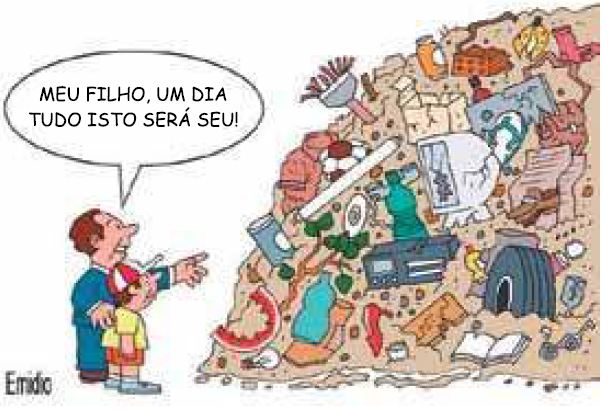

# Questao 1

Questão - 1
Leia o texto abaixo.

**Cientistas descobrem que animais usam dialetos para se comunicar**

Alguns animais utilizam "dialetos" para se comunicar, como as baleias, os golfinhos, as abelhas e as aves, afirmou a revista alemã de divulgação científica "P.M. Magazin" em sua edição de setembro. Este é outro aspecto mais em comum entre a forma de comunicação humana e dos animais, descoberta recentemente pela comunidade científica. Os golfinhos inventam diferentes assobios para se comunicar, segundo cientistas.

Um exemplo dos diferentes dialetos ocorre com o estrelinha-de-poupa (Regulus regulus), um pássaro de pequeno porte caracterizado por ter uma mancha amarela na cabeça, e cujo piar difere no tom de seus congêneres da China.

No caso dos golfinhos, animais que teriam uma inteligência parecida com a dos homens, os cientistas comprovaram que inventam diferentes assobios para se comunicar.

Um grupo de pesquisadores da Universidade de St. Andrews, na Escócia, demonstrou que os golfinhos têm a capacidade de conversar sobre um terceiro animal que não está presente.

O corvo ou o tuim-da-colômbia (Forpus conspicillatus), por exemplo, usam nomes personalizados para se chamar entre si. Além dos acústicos, alguns animais também utilizam outros meios de comunicação.

É o caso das aranhas-macho, que usam a rede tecida por uma fêmea para perguntar se podem se aproximar dela, já que se, dependendo do ritmo como andam pelos fios, podem ser confundidos com uma presa.

Disponível em: https://brasilescola.uol.com.br/redacao/texto-divulgacao-cientifica.htm. Acesso em 23 de abril de 2021.

**Dicas de apoio**
- O gênero textual "artigo de divulgação científica" geralmente utiliza uma linguagem formal.
- A linguagem formal é aquela que segue as normas gramaticais e é utilizada em contextos mais sérios e oficiais.
- Compare as características do texto com as opções dadas para identificar a linguagem correta.

**Passo a Passo**
1. Leia atentamente o texto fornecido e identifique o tipo de linguagem utilizada.
2. Reflita sobre as características de um texto de divulgação científica: geralmente é formal e informativo.
3. Considere o público-alvo do texto e o propósito de informar sobre descobertas científicas.
4. Compare com exemplos de linguagem formal e informal que você conhece.
5. Escolha a opção que melhor descreve a linguagem utilizada no texto.

A linguagem usada no artigo é

Opções de resposta:

A) informal com algumas gírias.

B) regional com palavras usadas naquela região.

C) formal, obedecendo a norma padrão da língua.

D) informal, com informações que todos conhecem.

# Questao 2

Questão - 2
O que os amigos fazem? Observe o quadrinho.

**Dicas de apoio**
- Observe as ações e expressões dos personagens nos quadrinhos para entender o que eles estão fazendo.
- Preste atenção nos textos dentro dos balões de fala, eles podem indicar as ações dos personagens.
- Relacione as imagens com as opções de resposta para encontrar a mais adequada.

**Passo a Passo**
1. Observe a imagem atentamente e identifique as ações dos personagens.
2. Reflita sobre o que essas ações indicam sobre o relacionamento entre os amigos.
3. Pense em palavras que descrevem ações positivas entre amigos, como compartilhar e apoiar.
4. Compare as opções de resposta com as ações observadas na imagem.
5. Escolha a opção que melhor descreve o que os amigos fazem.

Opções de resposta:

A) Brigam.

B) Disputam os brinquedos.

C) Compartilham os momentos e dão força uns ao outros.

D) Ficam zangados.

# Questao 3

Questão - 3

Fonte: Emidio. <https://lixoanormal.blogspot.com.br>. 14 Dez. 2015.

A oração - Meu filho, um dia tudo isto será seu! - tem sujeito

**Dicas de apoio**
- O sujeito da oração é quem ou o que realiza a ação ou de quem se fala.
- Identifique o núcleo do sujeito na oração para determinar se é simples, composto, indeterminado ou inexistente.
- Analise a oração para verificar se o sujeito está explícito ou implícito.

**Passo a Passo**
1. Leia a oração apresentada na questão.
2. Identifique o verbo principal da oração.
3. Reflita sobre quem ou o que está realizando a ação ou sendo descrito pelo verbo.
4. Lembre-se que o sujeito pode ser simples, composto, indeterminado ou inexistente.
5. Escolha a opção que corretamente identifica o sujeito da oração.

Opções de resposta:

A) simples: tudo isto.

B) simples: Meu filho.

C) indeterminado: um dia.

D) inexistente.

# Questao 4

Questão - 4
De modo geral, o gênero textual artigo de divulgação científica tem como público-alvo

**Dicas de apoio**
- O artigo de divulgação científica é destinado a um público amplo que busca informações sobre ciência.
- Considere que o objetivo é tornar a ciência acessível a pessoas não especializadas.
- Reflita sobre quem se interessaria por temas e descobertas científicas ao escolher a resposta.

**Passo a Passo**
1. Reflita sobre o que é um artigo de divulgação científica e seu propósito.
2. Considere quem geralmente se interessa por temas e descobertas científicas.
3. Pense sobre o nível de conhecimento necessário para entender um artigo desse tipo.
4. Compare as opções de resposta com o público que você acredita ser o alvo.
5. Escolha a opção que melhor descreve o público-alvo de um artigo de divulgação científica.

Opções de resposta:

A) estudiosos e cientistas.

B) quaisquer pessoas que queiram aumentar seus conhecimentos sobre temas e descobertas científicas.

C) crianças que se interessam por experiências científicas.

D) adolescentes e jovens.

# Questao 5

Observe a imagem abaixo e responda à pergunta a seguir: 

Qual é a principal função do componente destacado na imagem?

**Dicas de apoio**
- Identifique o componente na imagem e relacione com as funções descritas nas opções.
- Considere o contexto em que o componente é utilizado para determinar sua função principal.
- Utilize conhecimentos prévios sobre eletrônica para auxiliar na escolha da resposta correta.

**Passo a Passo**
1. Observe a imagem e identifique o componente destacado.
2. Reflita sobre o que você sabe sobre componentes elétricos e suas funções.
3. Pense em como cada opção de resposta se relaciona com a função de componentes elétricos.
4. Compare as opções de resposta com o que você identificou na imagem.
5. Escolha a opção que melhor descreve a função do componente destacado.

Opções de resposta:

A) Regular a tensão elétrica.

B) Armazenar energia elétrica.

C) Converter energia elétrica em energia térmica.

D) Proteger o circuito contra sobrecargas.

# Questao 6

A oração - **Meu filho, um dia tudo isto será seu!** - tem sujeito

**Dicas de apoio**
- O sujeito é a parte da oração que indica quem ou o que faz a ação.
- Procure identificar o núcleo do sujeito para determinar se ele é simples ou composto.
- Verifique se o sujeito está explícito ou implícito na oração.

**Passo a Passo**
1. Leia a oração apresentada na questão.
2. Identifique o verbo principal da oração.
3. Reflita sobre quem ou o que está realizando a ação ou sendo descrito pelo verbo.
4. Lembre-se que o sujeito pode ser simples, composto, indeterminado ou inexistente.
5. Escolha a opção que corretamente identifica o sujeito da oração.

Opções de resposta:

A) simples: tudo isto.

B) simples: Meu filho.

C) indeterminado: um dia.

D) inexistente.

# Questao 7

Questão - 6
Desde pequenos Cebolinha e Cascão já eram inseparáveis. Onde eles se encontravam?

**Dicas de apoio**
- Observe a imagem para identificar o local onde os personagens estão.
- Relacione elementos visuais da imagem com as opções de resposta.
- Considere o contexto dos personagens para ajudar na escolha da resposta correta.

**Passo a Passo**
1. Observe a imagem e identifique o cenário apresentado.
2. Reflita sobre os locais comuns onde amigos se encontram desde pequenos.
3. Pense sobre o contexto da imagem e o que ela sugere sobre o local.
4. Compare as opções de resposta com o cenário identificado na imagem.
5. Escolha a opção que melhor descreve onde Cebolinha e Cascão se encontravam.

Opções de resposta:

A) No campo de futebol.

B) No teatro.

C) No parque.

D) No cinema.

# Questao 8

Presentes em dicionários, glossários e enciclopédias, os verbetes são usados para definir termos e registrar significados de palavras. Veja um exemplo.

['(ca.a.tin.ga, ca.tin.ga)\nBot. Vegetação típica do sertão semiárido nordestino, composta esp. de pequenas árvores e arbustos espinhosos [...].']

CAATINGA. Disponível em: 

De acordo com o conteúdo estudado em **Abreviaturas e Siglas**, assinale a alternativa correta.

**Dicas de apoio**
- A abreviatura "Bot." refere-se a "Botânica", indicando que o termo está relacionado à ciência das plantas.
- Verifique o contexto em que a abreviatura é utilizada para entender sua função.
- Compare as opções de resposta com o uso da abreviatura no texto para escolher a correta.

**Passo a Passo**
1. Leia o exemplo de verbete apresentado na questão.
2. Identifique a abreviatura ou sigla destacada no verbete.
3. Reflita sobre o que essa abreviatura ou sigla representa no contexto do verbete.
4. Pense sobre o uso comum de abreviaturas e siglas em textos informativos.
5. Escolha a opção que corretamente descreve a função da abreviatura ou sigla no verbete.

Opções de resposta:

A) No fragmento, a abreviatura “Bot.” tem a função de informar

B) No fragmento, a sigla “Bot.” tem a função de informar

C) No fragmento, a abreviatura “Bot.” tem a função de informar

D) No fragmento, a abreviatura “Bot.” tem a função de informar

# Questao 9

Questão - 8
Com quem eles passeavam?

**Dicas de apoio**
- Observe a imagem para identificar as pessoas que estão com os personagens principais.
- Relacione os elementos visuais com as opções de resposta.
- Considere o contexto da cena para ajudar na escolha da resposta correta.

**Passo a Passo**
1. Observe a imagem e identifique as pessoas que estão passeando com os personagens.
2. Reflita sobre o contexto da imagem e o que ela sugere sobre a relação entre os personagens e as pessoas com quem estão.
3. Pense sobre as opções de resposta e como elas se relacionam com a imagem.
4. Compare as opções de resposta com o que você identificou na imagem.
5. Escolha a opção que melhor descreve com quem eles passeavam.

Opções de resposta:

A) Com as babás.

B) Com as avós.

C) Com as mães.

D) Com as irmãs.

# Questao 10

Questão - 9
Quando o cartão foi escrito?

**Dicas de apoio**
- Procure por pistas no texto ou imagem que indiquem a data em que o cartão foi escrito.
- Compare as opções de datas para verificar qual é a mais provável.
- Utilize o contexto da questão para auxiliar na escolha da resposta correta.

**Passo a Passo**
1. Leia a questão e identifique o que está sendo perguntado.
2. Reflita sobre a importância de datas em documentos como cartões.
3. Pense sobre como a data pode ser apresentada em um cartão.
4. Compare as opções de resposta e veja qual delas faz mais sentido no contexto de um cartão.
5. Escolha a opção que corretamente indica quando o cartão foi escrito.

Opções de resposta:

A) 29/03/2009.

B) 29/10/2009.

C) 29/11/2009.

D) 29/12/2009.

# Questao 11

Questão - 10
Assinale a alternativa que contém um sujeito simples.

**Dicas de apoio**
- Um sujeito simples é aquele que possui apenas um núcleo.
- Identifique o núcleo do sujeito em cada oração para determinar se é simples.
- Compare as opções de resposta para verificar qual delas possui um sujeito simples.

**Passo a Passo**
1. Leia cada alternativa e identifique o verbo principal em cada uma.
2. Reflita sobre quem ou o que está realizando a ação ou sendo descrito pelo verbo em cada alternativa.
3. Lembre-se que um sujeito simples é aquele que possui apenas um núcleo.
4. Compare as opções de resposta e veja qual delas possui um sujeito simples.
5. Escolha a opção que corretamente identifica uma frase com sujeito simples.

Opções de resposta:

A) Estuda-se loucamente neste colégio.

B) Entreguei as avaliações ontem mesmo.

C) Trabalha-se tranquilamente neste colégio.

D) A maioria dos alunos sairá de férias ainda este mês.

