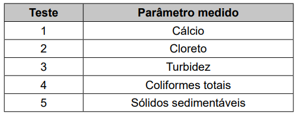
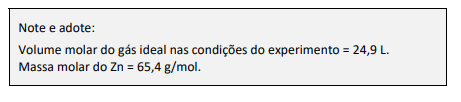
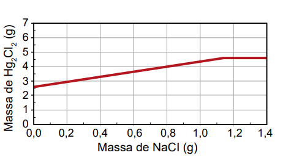

# Questao 1

Questão - 1
 Em uma indústria, o controle da dureza da água é importante quando ela é utilizada em caldeiras. Sais pouco solúveis, como sulfatos e carbonatos, podem acumular-se nas tubulações, causando obstruções. Para avaliar a água, foram realizados testes de qualidade considerando os seguintes parâmetros:

**Dicas de apoio**
- A dureza da água está relacionada principalmente à presença de íons de cálcio e magnésio, que formam sais insolúveis.
- Verifique na tabela qual teste mede a presença de cálcio, pois ele é um dos principais responsáveis pela dureza da água.

**Passo a Passo**
1. Revise o conceito de dureza da água e como ela pode causar obstruções em tubulações.
2. Analise a tabela apresentada na imagem para identificar quais parâmetros são medidos em cada teste.
3. Considere quais sais são responsáveis por obstruções e quais testes podem detectá-los.
4. Escolha o teste que mede o parâmetro relacionado aos sais que causam obstrução.

Qual teste deve ser considerado para controlar a formação de obstruções nas tubulações?

Opções de resposta:

A) 1

B) 2

C) 3

D) 4

E) 5

# Questao 2

O vidro contendo alumínio em sua composição é um excelente material para acondicionar medicamentos e suplementos, porque pode ser esterilizado por aquecimento. No entanto, quando o medicamento ou suplemento contém substâncias que se ligam fortemente ao íon desse metal, a dissolução do alumínio é promovida em função do deslocamento do equilíbrio químico estabelecido entre a espécie imobilizada no vidro e a espécie em solução. Por essa razão, recomenda-se que suplementos de nutrição de recém-nascidos contendo gluconato de cálcio sejam acondicionados em embalagens plásticas, e não nesse tipo de vidro.

Atualização da recomendação da Sociedade Portuguesa de Neonatologia. Disponível em: www.spneonatologia.pt. Acesso em: 22 out. 2021 (adaptado).

**Dicas de apoio**
- O deslocamento do equilíbrio químico pode ser explicado pela Lei de Le Chatelier, que prevê que um sistema em equilíbrio reage a uma mudança de concentração, temperatura ou pressão para contrabalançar essa mudança.
- Considere como a concentração de gluconato de cálcio pode afetar o equilíbrio químico e a solubilidade do alumínio.

**Passo a Passo**
1. Revise o conceito de equilíbrio químico e como ele pode ser deslocado.
2. Considere as condições que podem aumentar a solubilidade do alumínio.
3. Avalie cada opção de resposta considerando como ela pode afetar o equilíbrio químico.

Caso esse suplemento seja acondicionado em embalagem desse tipo de vidro, o risco de contaminação por alumínio será maior se o(a)

Opções de resposta:

A) vidro do frasco for translúcido.

B) concentração de gluconato de cálcio for alta.

C) frasco de vidro apresentar uma maior espessura.

D) vidro for previamente esterilizado em altas temperaturas.

E) reação do alumínio com gluconato de cálcio for endotérmica.

# Questao 3

Questão - 3
No início de 2023, um grupo de pesquisadores estudou o desenvolvimento de uma poliamina sólida contendo cobre, capaz de adsorver CO2 na fase gasosa e em baixas concentrações. A figura ao lado mostra o esquema de adsorção com a representação do sólido

**Dicas de apoio**
- A porcentagem em massa de um elemento em um composto pode ser calculada pela fórmula: $\text{Porcentagem} = \left(\frac{\text{massa do elemento}}{\text{massa total do composto}}\right) \times 100$.
- Considere a relação entre a massa de cobre e a capacidade de adsorção de CO2 para determinar a porcentagem em massa de cobre.

**Passo a Passo**
1. Revise o conceito de adsorção e como ela é medida.
2. Analise a equação química fornecida para entender a reação de adsorção.
3. Calcule a massa de CO2 adsorvida por 1 kg de poliamina e use essa informação para determinar a porcentagem de cobre.

De acordo com os autores do estudo, 1 kg de poliamina contendo cobre é capaz de adsorver até 5 mols de CO2, uma quantidade bem superior ao que se conhece até então. Com base nessas informações, pode-se concluir que a porcentagem em massa de cobre no sólido é cerca de

Opções de resposta:

A) 16% e que 1 kg do sólido é capaz de absorver até 110 g de gás carbônico.

B) 32% e que 1 kg do sólido é capaz de absorver até 110 g de gás carbônico.

C) 16% e que 1 kg do sólido é capaz de absorver até 220 g de gás carbônico.

D) 32% e que 1 kg do sólido é capaz de absorver até 220 g de gás carbônico.

# Questao 4

Questão - 4
Para gerar hidrogênio, foi utilizado o aparato ilustrado na figura.

Ao frasco à esquerda adicionou-se uma quantidade pré-determinada de raspas de zinco metálico e ácido clorídrico. Em seguida, o frasco foi fechado com uma rolha conectada a uma tubulação. À medida que o hidrogênio é produzido pela reação $Zn^0 (s) + 2H^+ (aq) \rightarrow Zn^{2+}(aq) + H_2(g)$, o gás se acumula em uma proveta previamente cheia de água. Dado que a solubilidade do hidrogênio na água é desprezível, o volume ocupado pelo gás na proveta corresponde ao volume de hidrogênio produzido durante a reação. Considerando que, nas condições do experimento, foram gerados 49,8 mL de hidrogênio, qual a quantidade de Zn metálico, em gramas, que de fato reagiu?

**Dicas de apoio**
- Utilize a equação química balanceada para entender a proporção entre as quantidades de reagentes e produtos.
- A equação do gás ideal pode ser útil: $PV = nRT$, onde $P$ é a pressão, $V$ é o volume, $n$ é o número de mols, $R$ é a constante dos gases e $T$ é a temperatura.
- Use a massa molar do Zn para converter mols de Zn em gramas.

**Passo a Passo**
1. Revise a reação química entre zinco e ácido clorídrico.
2. Use o volume de hidrogênio produzido para calcular a quantidade de gás em mols.
3. Utilize a relação estequiométrica da reação para determinar a massa de zinco que reagiu.

Opções de resposta:

A) 

 0,07

B) 0,13

C) 0,26

D) 0,29

E) 0,48

# Questao 5

Questão - 5
 Existe no comércio um produto antimofo constituído por uma embalagem com tampa perfurada contendo cloreto de cálcio anidro, CaCl2. Uma vez aberto o lacre, essa substância absorve a umidade ambiente, transformando-se em cloreto de cálcio di-hidratado, $CaCl_2 \cdot 2H_2O$. Considere a massa molar da água igual a 18 g mol−1, e a massa molar do cloreto de cálcio anidro igual a 111 g mol-1.

**Dicas de apoio**
- Para calcular o ganho percentual em massa, use a fórmula: $\text{Ganho percentual} = \left(\frac{\text{massa final} - \text{massa inicial}}{\text{massa inicial}}\right) \times 100$.
- Determine a massa do cloreto de cálcio di-hidratado e compare com a massa do cloreto de cálcio anidro.

**Passo a Passo**
1. Revise o processo de hidratação e como ele afeta a massa de uma substância.
2. Calcule a massa molar do cloreto de cálcio di-hidratado.
3. Determine o ganho percentual de massa ao comparar as massas molares antes e depois da hidratação.

Na hidratação da substância presente no antimofo, o ganho percentual, em massa, é mais próximo de

Opções de resposta:

A) 14%

B) 16%

C) 24%

D) 32%

E) 75%

# Questao 6

Questão - 6
Um assistente de laboratório precisou descartar sete frascos contendo solução de nitrato de mercúrio(I) que não foram utilizados em uma aula prática. Cada frasco continha 5,25 g de $Hg_2 (NO_3)_2$ dissolvidos em água. Temendo a toxidez do mercúrio e sabendo que o $Hg_2 Cl_2$ tem solubilidade muito baixa, o assistente optou por retirar o mercúrio da solução por precipitação com cloreto de sódio (NaCl), conforme a equação química:

$Hg_2(NO_3)_2 (aq) + 2 NaCl (aq) \rightarrow Hg_2Cl_2 (s) + 2 NaNO_3 (aq)$

Na dúvida sobre a massa de NaCl a ser utilizada, o assistente aumentou gradativamente a quantidade adicionada em cada frasco, como apresentado no quadro.

**Dicas de apoio**
- A equação química balanceada indica a proporção estequiométrica entre os reagentes e produtos.
- Use a relação molar entre Hg2(NO3)2 e NaCl para determinar a quantidade necessária de NaCl.
- Analise como a massa de NaCl influencia a massa de Hg2Cl2 obtida.

**Passo a Passo**
1. Revise a reação de precipitação e como ela é representada graficamente.
2. Analise a tabela de massas de NaCl adicionadas e compare com a massa de $Hg_2Cl_2$ obtida.
3. Identifique o gráfico que melhor representa a relação entre a massa de NaCl e a massa de $Hg_2Cl_2$.

Qual foi o gráfico obtido pelo assistente de laboratório?

Opções de resposta:

A) 

B) 

C) 

D) 

E) 

# Questao 7

Para que uma molécula dê origem a um medicamento de administração oral, além de apresentar atividade farmacológica, deve ser capaz de atingir o local de ação. Para tanto, essa molécula não deve se degradar no estômago (onde o meio é fortemente ácido e há várias enzimas que reagem mediante catálise ácida), deve ser capaz de atravessar as membranas celulares e ser solúvel no plasma sanguíneo (sistema aquoso). Para os fármacos cujas estruturas são formadas por cadeias carbônicas longas contendo pelo menos um grupamento amino, um recurso tecnológico empregado é sua conversão no cloridrato correspondente. Essa conversão é representada, de forma genérica, pela equação química:

$R_3N + HCl \rightarrow (R_3NH)^+Cl^-$

**Dicas de apoio**
- A formação de cloridratos aumenta a solubilidade em água e a estabilidade do fármaco.
- Considere como a conversão para cloridrato pode influenciar a eficiência de circulação do fármaco no sangue.

**Passo a Passo**
1. Revise o conceito de solubilidade e como ele é afetado pela formação de cloridratos.
2. Analise a equação química para entender a conversão de aminas em cloridratos.
3. Considere como a conversão afeta a solubilidade e a circulação no sangue.

O aumento da eficiência de circulação do fármaco no sangue, promovido por essa conversão, deve-se ao incremento de seu(sua)

Opções de resposta:

A) basicidade.

B) lipofilicidade.

C) caráter iônico.

D) cadeia carbônica.

E) estado de oxidação.

# Questao 8

Questão - 8
No processo de compra e venda de artigos de ouro, é comum testar os objetos para verificar se eles realmente são feitos de ouro ou se são alguma falsificação feita com metais menos nobres. Esse teste pode ser feito adicionando um pequeno volume de ácido forte concentrado às raspas do objeto a ser testado, conforme figura a seguir. Caso o objeto seja feito com ouro, as raspas permanecem visíveis, enquanto as raspas de falsificações são dissolvidas.

**Dicas de apoio**
- O potencial de redução padrão indica a tendência de uma espécie química ganhar elétrons.
- Compare o potencial de redução do ouro com o dos outros materiais listados para prever reações de oxidação ou redução.

**Passo a Passo**
1. Revise o conceito de potencial de redução padrão e como ele é utilizado para prever reações.
2. Analise a tabela de potenciais de redução para identificar materiais que não reagiriam com o ácido.
3. Escolha o material que possui um potencial de redução semelhante ao do ouro.

Considerando apenas o potencial de redução padrão, qual das alternativas apresenta um material que poderia gerar um falso positivo para o objeto de ouro no teste descrito?

Opções de resposta:

A) 

B) Mg

C) Al

D) Fe

E) Pt

F) F2

# Questao 9

A temperatura ideal para uso de um forno a lenha para preparo de pizzas pode ser inferida pela observação da coloração das paredes internas do forno. Abaixo da temperatura ideal, um material particulado preto proveniente da queima da lenha pode ser visto recobrindo as paredes internas. Quando a temperatura ideal é atingida, esse material particulado não é mais observado e a superfície mais clara do interior do forno pode ser vista, como apresentado nas fotos.

Forno abaixo da temperatura ideal.

 Forno na temperatura ideal.

**Dicas de apoio**
- A fuligem é um produto da combustão incompleta da lenha.
- Considere como a temperatura influencia a combustão e a formação de fuligem.

**Passo a Passo**
1. Revise o processo de combustão e como ele afeta a coloração das superfícies.
2. Considere como a temperatura influencia a presença de fuligem.
3. Analise as opções de resposta para identificar a explicação correta sobre a mudança de coloração.

A coloração da superfície interior do forno permite inferir a temperatura ideal, pois

Opções de resposta:

A) a fuligem advinda do processo de combustão incompleta da lenha deposita-se nas paredes e, com o aumento da temperatura, reage com o oxigênio do ar e produz gás carbônico, permitindo ver a cor mais clara da parede interna do forno.

B) a coloração preta é originada pela fuligem da combustão completa da lenha, o que causa o aumento da temperatura até que a parede do forno se torne incandescente, revelando sua cor mais clara.

C) a coloração preta é observada por conta da baixa quantidade de luz gerada pelas chamas da lenha em combustão a baixas temperaturas e essa quantidade de luz aumenta à medida que a temperatura se torna elevada.

D) o material particulado se funde, escorrendo pelas paredes do forno quando a temperatura ideal é atingida, revelando a coloração mais clara do interior do forno.

E) a alta quantidade de gás carbônico produzida em baixas temperaturas forma uma névoa que não permite a passagem de luz, o que torna o interior escuro.

# Questao 10

Questão - 10
 O Aldrin é um inseticida agrícola organoclorado sintético de baixa polaridade, cuja estrutura molecular simétrica, de fórmula $C_{12}H_{8}Cl_{6}$, está representada na figura. Introduzido na agricultura a partir da década de 1950, esse composto apresenta alta persistência no meio ambiente e acumulação nos organismos, sendo danoso para a saúde.

VIEGAS JÚNIOR, C. Terpenos com atividade inseticida: uma alternativa para o controle químico de insetos. Química Nova, v. 26, n. 3, 2003 (adaptado).

**Dicas de apoio**
- Compostos de baixa polaridade tendem a se acumular em tecidos ricos em gordura.
- Considere como a polaridade do Aldrin influencia sua distribuição nos fluidos corporais.

Um pesquisador coletou fluidos biológicos de indivíduos de uma população contaminada por esse inseticida agrícola. Ele analisou amostras de saliva, sangue, lágrima, urina e leite quanto à presença dessa substância.

Em qual dos fluidos o pesquisador provavelmente encontrou a maior concentração dessa substância?

Opções de resposta:

A) Saliva, por consequência da atividade de enzimas.

B) Sangue, em função das hemácias e leucócitos.

C) Lágrima, em razão da concentração de sais.

D) Urina, pela presença de moléculas de ureia.

E) Leite, por causa do alto teor de gorduras.

