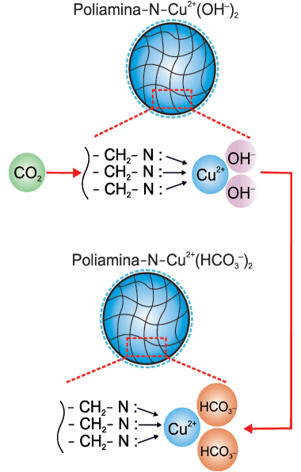
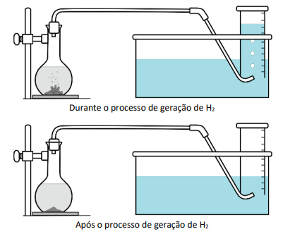
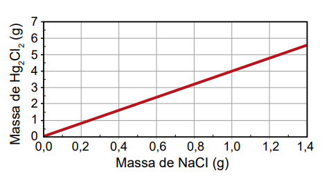
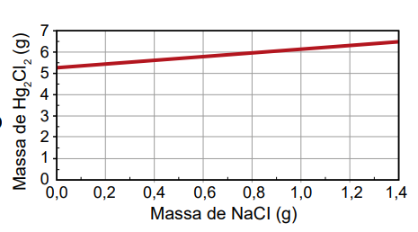
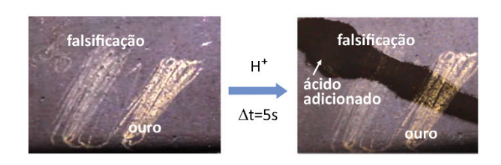
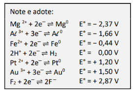

# Questao 1

Questão - 1
Em uma indústria, o controle da dureza da água é importante quando ela é utilizada em caldeiras. Sais pouco solúveis, formados a partir de sulfatos e carbonatos, podem acumular-se no interior das tubulações, causando obstruções. Para avaliar a água utilizada nessa indústria, foram realizados testes de qualidade que consideraram os seguintes parâmetros:

Qual teste deve ser considerado para controlar a formação desse tipo de obstrução de tubulações?

**Passo a Passo**
1. Observe os parâmetros medidos em cada teste na tabela fornecida.
2. Identifique quais sais são responsáveis pela dureza da água e obstrução das tubulações.
3. Relacione esses sais aos parâmetros medidos nos testes.
4. Determine qual teste mede o parâmetro que mais contribui para a formação de sais pouco solúveis.

Opções de resposta:

A) 1

B) 2

C) 3

D) 4

E) 5

# Questao 2

O vidro contendo alumínio em sua composição é um excelente material para acondicionar medicamentos e suplementos, porque pode ser esterilizado por aquecimento. No entanto, quando o medicamento ou suplemento contém substâncias que se ligam fortemente ao íon desse metal, a dissolução do alumínio é promovida. Isso ocorre devido ao deslocamento do equilíbrio químico entre a espécie imobilizada no vidro e a espécie em solução.

Por essa razão, recomenda-se que suplementos de nutrição de recém-nascidos contendo gluconato de cálcio sejam acondicionados em embalagens plásticas, e não nesse tipo de vidro.

Atualização da recomendação da Sociedade Portuguesa de Neonatologia. Disponível em: www.spneonatologia.pt. Acesso em: 22 out. 2021 (adaptado).

Caso esse suplemento seja acondicionado em embalagem desse tipo de vidro, o risco de contaminação por alumínio será maior se o(a)

**Passo a Passo**
1. Revise o conceito de equilíbrio químico e como ele pode ser deslocado.
2. Identifique a substância que pode deslocar o equilíbrio no contexto da questão.
3. Analise as opções e relacione-as com o conceito de deslocamento de equilíbrio.

Opções de resposta:

A) vidro do frasco for translúcido.

B) concentração de gluconato de cálcio for alta.

C) frasco de vidro apresentar uma maior espessura.

D) vidro for previamente esterilizado em altas temperaturas.

E) reação do alumínio com gluconato de cálcio for endotérmica.

# Questao 3

Questão - 3
No início de 2023, um grupo de pesquisadores estudou o desenvolvimento de uma poliamina sólida contendo cobre, capaz de adsorver CO2 na fase gasosa e em baixas concentrações. A figura ao lado mostra o esquema de adsorção com a representação do sólido.

De acordo com os autores do estudo, 1 kg de poliamina contendo cobre é capaz de adsorver até 5 mols de CO2, uma quantidade bem superior ao que se conhece até então. Com base nessas informações, pode-se concluir que a porcentagem em massa de cobre no sólido é cerca de

**Passo a Passo**
1. Revise o conceito de adsorção e como ele se relaciona com a massa do adsorvente.
2. Calcule a massa de CO2 adsorvida por 1 kg de poliamina.
3. Use a relação entre massa de cobre e massa de poliamina para encontrar a porcentagem em massa de cobre.

Opções de resposta:

A) 16% e que 1 kg do sólido é capaz de absorver até 110 g de gás carbônico.

B) 32% e que 1 kg do sólido é capaz de absorver até 110 g de gás carbônico.

C) 16% e que 1 kg do sólido é capaz de absorver até 220 g de gás carbônico.

D) 32% e que 1 kg do sólido é capaz de absorver até 220 g de gás carbônico.

# Questao 4

Questão - 4
Para gerar hidrogênio, foi utilizado o aparato ilustrado na figura.

Ao frasco à esquerda adicionou-se uma quantidade pré-determinada de raspas de zinco metálico e ácido clorídrico. Em seguida, o frasco foi fechado com uma rolha conectada a uma tubulação. À medida que o hidrogênio é produzido pela reação $Zn^0 (s) + 2H^+ (aq) \rightarrow Zn^{2+}(aq) + H_2(g)$, o gás se acumula em uma proveta previamente cheia de água.

Dado que a solubilidade do hidrogênio na água é desprezível, o volume ocupado pelo gás na proveta corresponde ao volume de hidrogênio produzido durante a reação.

Considerando que, nas condições do experimento, foram gerados 49,8 mL de hidrogênio, qual a quantidade de Zn metálico, em gramas, que de fato reagiu?

**Passo a Passo**
1. Revise a reação química entre zinco e ácido clorídrico.
2. Use o volume de hidrogênio produzido para calcular a quantidade de mols de H2.
3. Relacione a quantidade de mols de H2 com a quantidade de mols de Zn que reagiu.

Opções de resposta:

A) 

 0,07

B) 0,13

C) 0,26

D) 0,29

E) 0,48

# Questao 5

Questão - 5
Existe no comércio um produto antimofo constituído por uma embalagem com tampa perfurada contendo cloreto de cálcio anidro, CaCl2. Uma vez aberto o lacre, essa substância absorve a umidade ambiente, transformando-se em cloreto de cálcio di-hidratado, CaCl2 $\cdot$ 2H2O.

Considere a massa molar da água igual a 18 g mol−1, e a massa molar do cloreto de cálcio anidro igual a 111 g mol-1.

Na hidratação da substância presente no antimofo, o ganho percentual, em massa, é mais próximo de

**Passo a Passo**
1. Calcule a massa molar do cloreto de cálcio di-hidratado.
2. Compare a massa molar do cloreto de cálcio anidro com a do di-hidratado.
3. Determine o ganho percentual em massa devido à hidratação.

Opções de resposta:

A) 14%

B) 16%

C) 24%

D) 32%

E) 75%

# Questao 6

Questão - 6
Um assistente de laboratório precisou descartar sete frascos contendo solução de nitrato de mercúrio(I) que não foram utilizados em uma aula prática. Cada frasco continha 5,25 g de Hg2 (NO3)2 dissolvidos em água. Temendo a toxidez do mercúrio e sabendo que o Hg2 Cl2 tem solubilidade muito baixa, o assistente optou por retirar o mercúrio da solução por precipitação com cloreto de sódio (NaCl), conforme a equação química:

$Hg_2(NO_3)_2 (aq) + 2 NaCl (aq) \rightarrow Hg_2Cl_2 (s) + 2 NaNO_3 (aq)$

Na dúvida sobre a massa de NaCl a ser utilizada, o assistente aumentou gradativamente a quantidade adicionada em cada frasco, como apresentado no quadro.

O produto obtido em cada experimento foi filtrado, secado e teve sua massa aferida. O assistente organizou os resultados na forma de um gráfico que correlaciona a massa de NaCl adicionada com a massa de Hg2Cl2 obtida em cada frasco.

A massa molar do Hg2 (NO3)2 é 525 g mol-1, a do NaCl é 58 g mol-1 e a do Hg2Cl2 é 472 g mol-1.

Qual foi o gráfico obtido pelo assistente de laboratório?

**Passo a Passo**
1. Revise a reação de precipitação e a relação estequiométrica entre os reagentes e produtos.
2. Calcule a quantidade de NaCl necessária para precipitar todo o Hg2Cl2.
3. Analise os gráficos e identifique qual representa corretamente a relação entre a massa de NaCl e a massa de Hg2Cl2.

Opções de resposta:

A) 

B) 

C) 

D) 

E) 

# Questao 7

Para que uma molécula dê origem a um medicamento de administração oral, além de apresentar atividade farmacológica, deve ser capaz de atingir o local de ação. Para tanto, essa molécula não deve se degradar no estômago (onde o meio é fortemente ácido e há várias enzimas que reagem mediante catálise ácida), deve ser capaz de atravessar as membranas celulares e ser solúvel no plasma sanguíneo (sistema aquoso). Para os fármacos cujas estruturas são formadas por cadeias carbônicas longas contendo pelo menos um grupamento amino, um recurso tecnológico empregado é sua conversão no cloridrato correspondente. Essa conversão é representada, de forma genérica, pela equação química:

$R_3N + HCl \rightarrow (R_3NH)^+Cl^-$

O aumento da eficiência de circulação do fármaco no sangue, promovido por essa conversão, deve-se ao incremento de seu(sua)

**Passo a Passo**
1. Revise o conceito de solubilidade e como a formação de cloridratos pode afetá-la.
2. Relacione a estrutura química do fármaco com suas propriedades farmacológicas.
3. Analise as opções e determine qual propriedade é aumentada pela conversão em cloridrato.

Opções de resposta:

A) basicidade.

B) lipofilicidade.

C) caráter iônico.

D) cadeia carbônica.

E) estado de oxidação.

# Questao 8

Questão - 8
No processo de compra e venda de artigos de ouro, é comum testar os objetos para verificar se eles realmente são feitos de ouro ou se são alguma falsificação feita com metais menos nobres. Esse teste pode ser feito adicionando um pequeno volume de ácido forte concentrado às raspas do objeto a ser testado, conforme figura a seguir. Caso o objeto seja feito com ouro, as raspas permanecem visíveis, enquanto as raspas de falsificações são dissolvidas.

Considerando apenas o potencial de redução padrão, qual das alternativas apresenta um material que poderia gerar um falso positivo para o objeto de ouro no teste descrito?

**Passo a Passo**
1. Revise o conceito de potencial de redução padrão e sua aplicação em reações de oxidação-redução.
2. Analise a tabela de potenciais de redução fornecida.
3. Compare os potenciais de redução dos materiais listados com o do ouro.

Opções de resposta:

A) 

B) Mg

C) Al

D) Fe

E) Pt

F) F2

# Questao 9

A temperatura ideal para uso de um forno a lenha para preparo de pizzas pode ser inferida pela observação da coloração das paredes internas do forno. Abaixo da temperatura ideal, um material particulado preto proveniente da queima da lenha pode ser visto recobrindo as paredes internas. Quando a temperatura ideal é atingida, esse material particulado não é mais observado e a superfície mais clara do interior do forno pode ser vista, como apresentado nas fotos.

Forno abaixo da temperatura ideal.

 Forno na temperatura ideal.

A coloração da superfície interior do forno permite inferir a temperatura ideal, pois

**Passo a Passo**
1. Revise o processo de combustão e a formação de fuligem.
2. Relacione a presença de fuligem com a temperatura do forno.
3. Analise as opções e determine qual descreve corretamente a relação entre coloração e temperatura.

Opções de resposta:

A) a fuligem advinda do processo de combustão incompleta da lenha deposita-se nas paredes e, com o aumento da temperatura, reage com o oxigênio do ar e produz gás carbônico, permitindo ver a cor mais clara da parede interna do forno.

B) a coloração preta é originada pela fuligem da combustão completa da lenha, o que causa o aumento da temperatura até que a parede do forno se torne incandescente, revelando sua cor mais clara.

C) a coloração preta é observada por conta da baixa quantidade de luz gerada pelas chamas da lenha em combustão a baixas temperaturas e essa quantidade de luz aumenta à medida que a temperatura se torna elevada.

D) o material particulado se funde, escorrendo pelas paredes do forno quando a temperatura ideal é atingida, revelando a coloração mais clara do interior do forno.

E) a alta quantidade de gás carbônico produzida em baixas temperaturas forma uma névoa que não permite a passagem de luz, o que torna o interior escuro.

# Questao 10

Questão - 10
O Aldrin é um inseticida agrícola organoclorado sintético de baixa polaridade, cuja estrutura molecular simétrica, de fórmula $C_{12}H_{8}Cl_{6}$, está representada na figura. Introduzido na agricultura a partir da década de 1950, esse composto apresenta alta persistência no meio ambiente e acumulação nos organismos, sendo danoso para a saúde.

Um pesquisador coletou fluidos biológicos de indivíduos de uma população contaminada por esse inseticida agrícola. Ele analisou amostras de saliva, sangue, lágrima, urina e leite quanto à presença dessa substância.

Em qual dos fluidos o pesquisador provavelmente encontrou a maior concentração dessa substância?

**Passo a Passo**
1. Revise as propriedades de solubilidade de compostos organoclorados.
2. Relacione a solubilidade com a composição dos fluidos biológicos mencionados.
3. Analise as opções e determine em qual fluido a substância é mais provável de se acumular.

Opções de resposta:

A) Saliva, por consequência da atividade de enzimas.

B) Sangue, em função das hemácias e leucócitos.

C) Lágrima, em razão da concentração de sais.

D) Urina, pela presença de moléculas de ureia.

E) Leite, por causa do alto teor de gorduras.

