# Questao 1

Questão - 1
 Em uma indústria, o controle da dureza da água é importante quando ela é utilizada em caldeiras, uma vez que sais pouco solúveis, formados a partir de sulfatos e carbonatos, podem acumular-se no interior das tubulações, causando obstruções. Para avaliar a água utilizada nessa indústria, foram realizados testes de qualidade que consideraram os seguintes parâmetros:

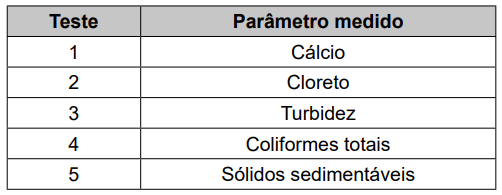

**Dicas de apoio**
- A dureza da água é geralmente causada pela presença de íons de cálcio e magnésio.
- Os sais pouco solúveis, como carbonatos e sulfatos, podem precipitar e causar incrustações.
- Testes que medem a concentração de cálcio são relevantes para o controle da dureza da água.

**Passo a Passo**
1. Revise o conceito de dureza da água e como ela pode causar obstruções em tubulações.
2. Analise a tabela fornecida na imagem para identificar quais parâmetros estão sendo medidos em cada teste.
3. Relacione os parâmetros medidos com a formação de sais pouco solúveis, como sulfatos e carbonatos.
4. Identifique qual teste mede o parâmetro que está diretamente relacionado à formação de obstruções.

Qual teste deve ser considerado para controlar a formação desse tipo de obstrução de tubulações?

Opções de resposta:

A) 1

B) 2

C) 3

D) 4

E) 5

# Questao 2

O vidro contendo alumínio em sua composição é um excelente material para acondicionar medicamentos e suplementos, porque pode ser esterilizado por aquecimento. No entanto, quando o medicamento ou suplemento contém substâncias que se ligam fortemente ao íon desse metal, a dissolução do alumínio é promovida em função do deslocamento do equilíbrio químico estabelecido entre a espécie imobilizada no vidro e a espécie em solução. Por essa razão, recomenda-se que suplementos de nutrição de recém-nascidos contendo gluconato de cálcio sejam acondicionados em embalagens plásticas, e não nesse tipo de vidro.

Atualização da recomendação da Sociedade Portuguesa de Neonatologia. Disponível em: www.spneonatologia.pt. Acesso em: 22 out. 2021 (adaptado).

**Dicas de apoio**
- O deslocamento do equilíbrio químico pode ser influenciado pela concentração das espécies em solução.
- Substâncias que formam complexos estáveis com íons metálicos podem aumentar a solubilidade do metal.

**Passo a Passo**
1. Revise o conceito de equilíbrio químico e como ele pode ser deslocado.
2. Considere como a concentração de reagentes e produtos pode afetar o equilíbrio.
3. Analise cada opção de resposta para identificar qual delas poderia aumentar a dissolução do alumínio.

Caso esse suplemento seja acondicionado em embalagem desse tipo de vidro, o risco de contaminação por alumínio será maior se o(a)

Opções de resposta:

A) vidro do frasco for translúcido.

B) concentração de gluconato de cálcio for alta.

C) frasco de vidro apresentar uma maior espessura.

D) vidro for previamente esterilizado em altas temperaturas.

E) reação do alumínio com gluconato de cálcio for endotérmica.

# Questao 3

Questão - 3
No início de 2023, um grupo de pesquisadores estudou o desenvolvimento de uma poliamina sólida contendo cobre, capaz de adsorver CO2 na fase gasosa e em baixas concentrações. A figura ao lado mostra o esquema de adsorção com a representação do sólido

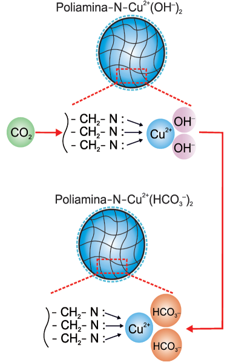

De acordo com os autores do estudo, 1 kg de poliamina contendo cobre é capaz de adsorver até 5 mols de CO2, uma quantidade bem superior ao que se conhece até então. Com base nessas informações, pode-se concluir que a porcentagem em massa de cobre no sólido é cerca de

**Dicas de apoio**
- A adsorção é um processo onde moléculas de gás se aderem à superfície de um sólido.
- A quantidade de gás adsorvido pode ser relacionada à área de superfície e à composição do adsorvente.
- Para calcular a porcentagem em massa de cobre, considere a massa total do sólido e a massa de cobre presente.

**Passo a Passo**
1. Revise o conceito de adsorção e como ele é medido em termos de massa e mols.
2. Considere a relação entre a massa de cobre e a capacidade de adsorção de CO2.
3. Utilize a equação química fornecida para entender a interação entre o cobre e o CO2.
4. Calcule a porcentagem em massa de cobre com base nas informações fornecidas.

Opções de resposta:

A) 16% e que 1 kg do sólido é capaz de absorver até 110 g de gás carbônico.

B) 32% e que 1 kg do sólido é capaz de absorver até 110 g de gás carbônico.

C) 16% e que 1 kg do sólido é capaz de absorver até 220 g de gás carbônico.

D) 32% e que 1 kg do sólido é capaz de absorver até 220 g de gás carbônico.

# Questao 4

Questão - 4
Para gerar hidrogênio, foi utilizado o aparato ilustrado na figura.

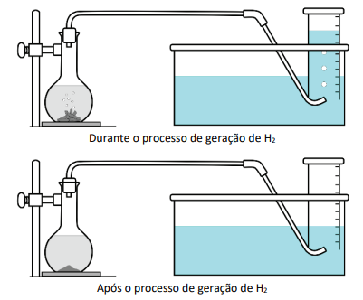

Ao frasco à esquerda adicionou-se uma quantidade pré-determinada de raspas de zinco metálico e ácido clorídrico. Em seguida, o frasco foi fechado com uma rolha conectada a uma tubulação. À medida que o hidrogênio é produzido pela reação $Zn^0 (s) + 2H^+ (aq) \rightarrow Zn^{2+}(aq) + H_2(g)$, o gás se acumula em uma proveta previamente cheia de água. Dado que a solubilidade do hidrogênio na água é desprezível, o volume ocupado pelo gás na proveta corresponde ao volume de hidrogênio produzido durante a reação. Considerando que, nas condições do experimento, foram gerados 49,8 mL de hidrogênio, qual a quantidade de Zn metálico, em gramas, que de fato reagiu?

**Dicas de apoio**
- A reação química apresentada é uma reação de deslocamento, onde o zinco desloca o hidrogênio do ácido.
- Use a relação estequiométrica da reação para determinar a quantidade de zinco que reage.
- Considere o volume molar do gás ideal e a massa molar do zinco para calcular a massa de zinco.

**Passo a Passo**
1. Revise a equação química da reação entre zinco e ácido clorídrico.
2. Considere o volume de hidrogênio produzido e como ele se relaciona com a quantidade de zinco que reagiu.
3. Utilize o volume molar do gás ideal para converter o volume de hidrogênio em mols.
4. Calcule a massa de zinco que reagiu usando a massa molar do zinco.

Opções de resposta:

A) 
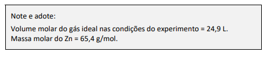
 0,07

B) 0,13

C) 0,26

D) 0,29

E) 0,48

# Questao 5

Questão - 5
Existe no comércio um produto antimofo constituído por uma embalagem com tampa perfurada contendo cloreto de cálcio anidro, CaCl2. Uma vez aberto o lacre, essa substância absorve a umidade ambiente, transformando-se em cloreto de cálcio di-hidratado, $CaCl_2 \cdot 2H_2O$. Considere a massa molar da água igual a 18 g mol−1, e a massa molar do cloreto de cálcio anidro igual a 111 g mol-1.

**Dicas de apoio**
- O ganho percentual em massa pode ser calculado pela diferença de massa entre o produto hidratado e o anidro.
- Considere a adição de duas moléculas de água para cada molécula de cloreto de cálcio.
- Use a fórmula de ganho percentual: $\text{Ganho percentual} = \frac{\text{massa final} - \text{massa inicial}}{\text{massa inicial}} \times 100$.

**Passo a Passo**
1. Revise o processo de hidratação e como ele afeta a massa de uma substância.
2. Calcule a massa do cloreto de cálcio di-hidratado formada a partir do cloreto de cálcio anidro.
3. Determine o ganho de massa devido à adição de moléculas de água.
4. Calcule o ganho percentual em massa comparando a massa inicial e final.

Na hidratação da substância presente no antimofo, o ganho percentual, em massa, é mais próximo de

Opções de resposta:

A) 14%

B) 16%

C) 24%

D) 32%

E) 75%

# Questao 6

Questão - 6
Um assistente de laboratório precisou descartar sete frascos contendo solução de nitrato de mercúrio(I) que não foram utilizados em uma aula prática. Cada frasco continha 5,25 g de $Hg_2 (NO_3)_2$ dissolvidos em água. Temendo a toxidez do mercúrio e sabendo que o $Hg_2 Cl_2$ tem solubilidade muito baixa, o assistente optou por retirar o mercúrio da solução por precipitação com cloreto de sódio (NaCl), conforme a equação química:

$Hg_2(NO_3)_2 (aq) + 2 NaCl (aq) \rightarrow Hg_2Cl_2 (s) + 2 NaNO_3 (aq)$

Na dúvida sobre a massa de NaCl a ser utilizada, o assistente aumentou gradativamente a quantidade adicionada em cada frasco, como apresentado no quadro.

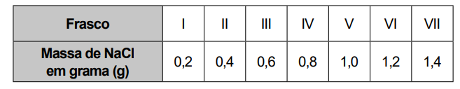

O produto obtido em cada experimento foi filtrado, secado e teve sua massa aferida. O assistente organizou os resultados na forma de um gráfico que correlaciona a massa de NaCl adicionada com a massa de $Hg_2Cl_2$ obtida em cada frasco. A massa molar do $Hg_2 (NO_3)_2$ é 525 g mol-1, a do NaCl é 58 g mol-1 e a do $Hg_2Cl_2$ é 472 g mol-1.

**Dicas de apoio**
- A reação apresentada é uma reação de precipitação, onde o mercúrio é removido da solução como um sólido insolúvel.
- Use a estequiometria da reação para determinar a quantidade de NaCl necessária para precipitar todo o mercúrio.
- Considere a massa molar dos reagentes e produtos para calcular as quantidades envolvidas.

**Passo a Passo**
1. Revise a equação química da reação de precipitação e como ela afeta a massa dos produtos formados.
2. Analise a tabela de massas de NaCl adicionadas e como isso se relaciona com a massa de $Hg_2Cl_2$ obtida.
3. Considere a solubilidade dos produtos e como isso pode afetar a quantidade de precipitado formado.
4. Identifique o gráfico que melhor representa a relação entre a massa de NaCl e a massa de $Hg_2Cl_2$.

Qual foi o gráfico obtido pelo assistente de laboratório?

Opções de resposta:

A) 
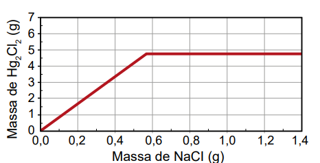

B) 
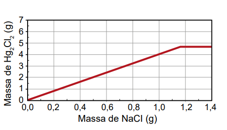

C) 
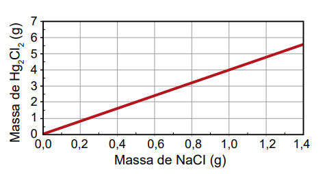

D) 

E) 
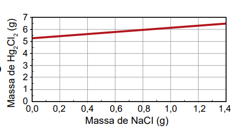

# Questao 7

Para que uma molécula dê origem a um medicamento de administração oral, além de apresentar atividade farmacológica, deve ser capaz de atingir o local de ação. Para tanto, essa molécula não deve se degradar no estômago (onde o meio é fortemente ácido e há várias enzimas que reagem mediante catálise ácida), deve ser capaz de atravessar as membranas celulares e ser solúvel no plasma sanguíneo (sistema aquoso). Para os fármacos cujas estruturas são formadas por cadeias carbônicas longas contendo pelo menos um grupamento amino, um recurso tecnológico empregado é sua conversão no cloridrato correspondente. Essa conversão é representada, de forma genérica, pela equação química:

$R_3N + HCl \rightarrow (R_3NH)^+Cl^-$

**Dicas de apoio**
- A conversão em cloridrato aumenta a solubilidade em água, facilitando a absorção no trato gastrointestinal.
- O cloridrato é uma forma iônica, o que pode aumentar a estabilidade do fármaco em meio ácido.
- Considere as propriedades físico-químicas que favorecem a absorção e circulação do fármaco no organismo.

**Passo a Passo**
1. Revise o conceito de solubilidade e como ele é afetado pela presença de grupos iônicos.
2. Considere como a conversão para cloridrato pode aumentar a solubilidade no plasma sanguíneo.
3. Analise cada opção de resposta para identificar qual propriedade é aumentada pela conversão.

O aumento da eficiência de circulação do fármaco no sangue, promovido por essa conversão, deve-se ao incremento de seu(sua)

Opções de resposta:

A) basicidade.

B) lipofilicidade.

C) caráter iônico.

D) cadeia carbônica.

E) estado de oxidação.

# Questao 8

Questão - 8
No processo de compra e venda de artigos de ouro, é comum testar os objetos para verificar se eles realmente são feitos de ouro ou se são alguma falsificação feita com metais menos nobres. Esse teste pode ser feito adicionando um pequeno volume de ácido forte concentrado às raspas do objeto a ser testado, conforme figura a seguir. Caso o objeto seja feito com ouro, as raspas permanecem visíveis, enquanto as raspas de falsificações são dissolvidas.

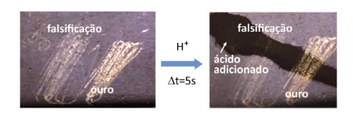

**Dicas de apoio**
- O teste de autenticidade baseia-se na resistência do ouro à corrosão por ácidos fortes.
- Metais com potenciais de redução maiores que o ouro não serão dissolvidos no ácido.
- Considere os potenciais de redução padrão para identificar materiais que podem resistir à corrosão.

**Passo a Passo**
1. Revise o conceito de potencial de redução padrão e como ele pode ser utilizado para prever reações.
2. Analise a tabela de potenciais de redução para identificar quais materiais têm potenciais semelhantes ao ouro.
3. Considere como um potencial de redução semelhante ao do ouro poderia resultar em um falso positivo.

Considerando apenas o potencial de redução padrão, qual das alternativas apresenta um material que poderia gerar um falso positivo para o objeto de ouro no teste descrito?

Opções de resposta:

A) 
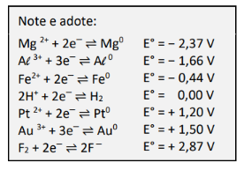

B) Mg

C) Al

D) Fe

E) Pt

F) F2

# Questao 9

A temperatura ideal para uso de um forno a lenha para preparo de pizzas pode ser inferida pela observação da coloração das paredes internas do forno. Abaixo da temperatura ideal, um material particulado preto proveniente da queima da lenha pode ser visto recobrindo as paredes internas. Quando a temperatura ideal é atingida, esse material particulado não é mais observado e a superfície mais clara do interior do forno pode ser vista, como apresentado nas fotos.

Forno abaixo da temperatura ideal.

 Forno na temperatura ideal.

**Dicas de apoio**
- A fuligem é um produto da combustão incompleta, que ocorre em temperaturas mais baixas.
- Quando a temperatura aumenta, a combustão se torna mais completa, reduzindo a formação de fuligem.
- Observe as mudanças na coloração das paredes internas como indicativo de temperatura adequada.

**Passo a Passo**
1. Revise o processo de combustão e como ele afeta a formação de fuligem.
2. Considere como a temperatura influencia a reação entre a fuligem e o oxigênio.
3. Analise cada opção de resposta para identificar como a coloração do forno está relacionada à temperatura.

A coloração da superfície interior do forno permite inferir a temperatura ideal, pois

Opções de resposta:

A) a fuligem advinda do processo de combustão incompleta da lenha deposita-se nas paredes e, com o aumento da temperatura, reage com o oxigênio do ar e produz gás carbônico, permitindo ver a cor mais clara da parede interna do forno.

B) a coloração preta é originada pela fuligem da combustão completa da lenha, o que causa o aumento da temperatura até que a parede do forno se torne incandescente, revelando sua cor mais clara.

C) a coloração preta é observada por conta da baixa quantidade de luz gerada pelas chamas da lenha em combustão a baixas temperaturas e essa quantidade de luz aumenta à medida que a temperatura se torna elevada.

D) o material particulado se funde, escorrendo pelas paredes do forno quando a temperatura ideal é atingida, revelando a coloração mais clara do interior do forno.

E) a alta quantidade de gás carbônico produzida em baixas temperaturas forma uma névoa que não permite a passagem de luz, o que torna o interior escuro.

# Questao 10

Questão - 10
O Aldrin é um inseticida agrícola organoclorado sintético de baixa polaridade, cuja estrutura molecular simétrica, de fórmula $C_{12}H_{8}Cl_{6}$, está representada na figura. Introduzido na agricultura a partir da década de 1950, esse composto apresenta alta persistência no meio ambiente e acumulação nos organismos, sendo danoso para a saúde.

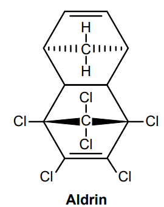

VIEGAS JÚNIOR, C. Terpenos com atividade inseticida: uma alternativa para o controle químico de insetos. Química Nova, v. 26, n. 3, 2003 (adaptado).

Um pesquisador coletou fluidos biológicos de indivíduos de uma população contaminada por esse inseticida agrícola. Ele analisou amostras de saliva, sangue, lágrima, urina e leite quanto à presença dessa substância.

**Dicas de apoio**
- Compostos de baixa polaridade tendem a se acumular em tecidos ricos em lipídios.
- O leite, por ser rico em gorduras, pode concentrar substâncias lipofílicas.
- Considere a afinidade do Aldrin por ambientes lipídicos ao prever sua distribuição nos fluidos.

Em qual dos fluidos o pesquisador provavelmente encontrou a maior concentração dessa substância?

Opções de resposta:

A) Saliva, por consequência da atividade de enzimas.

B) Sangue, em função das hemácias e leucócitos.

C) Lágrima, em razão da concentração de sais.

D) Urina, pela presença de moléculas de ureia.

E) Leite, por causa do alto teor de gorduras.

